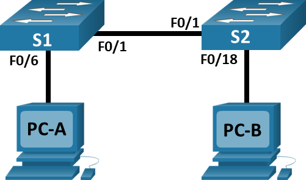
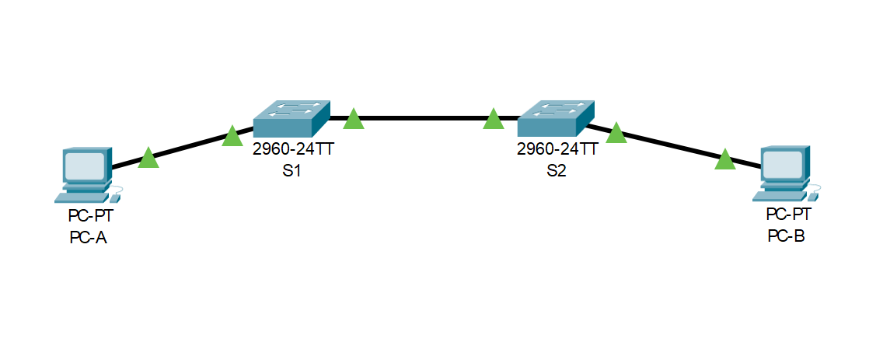
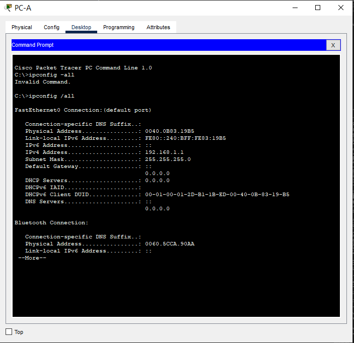
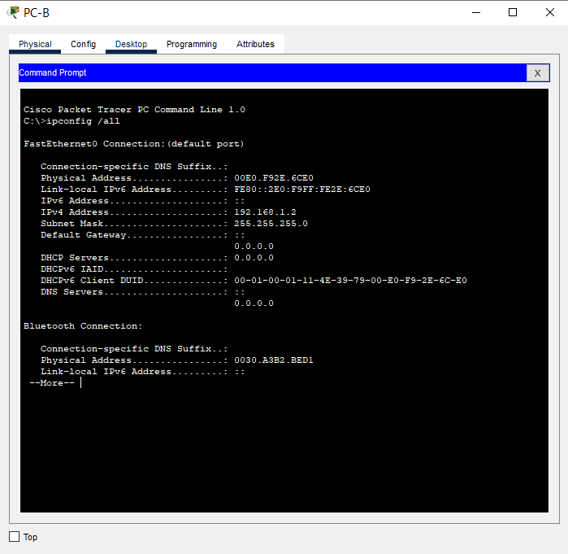

#  Лабораторная работа. Просмотр таблицы MAC-адресов коммутатора

#### Топология


#### Таблица адресации
| Устройство | Интерфейс | IP-адрес      | Маска подсети    |
|------------|-----------|---------------|------------------|
| S1         | VLAN 1    | 192.168.1.11  | 255.255.255.0    |
| S2         | VLAN 1    | 192.168.1.12  | 255.255.255.0    |
| PC-A       | NIC       | 192.168.1.1   | 255.255.255.0    |
| PC-B       | NIC       | 192.168.1.2   | 255.255.255.0    |
#### Цели:
1. [__Часть 1. Создание и настройка сети__](#часть-1-создание-и-настройка-сети)
2. [__Часть 2. Изучение таблицы МАС-адресов коммутатора__](#часть-2-изучение-таблицы-мас-адресов-коммутатора)

### Часть 1. Создание и настройка сети
Подключаем сеть в соответствии с топологией, настраиваем узлы в соответсвии с топологией, настриваем базовые параметры каждого коммутатора



[Итоговый файл cpt для этой лабораторной](./model.pkt)

[Пример настройки коммутатора S1](./S1_conf)

[Пример настройки коммутатора S2](./S2_conf)

### Часть 2. Изучение таблицы МАС-адресов коммутатора

### Шаг 1. Запишем МАС-адреса сетевых устройств
С помощью командной строки на PC-A и PC-B и команды `ipconfig /all` узнаем MAC-адреса компьютеров А и B:



#### Видим MAC-адреса:

- `0040.0B83.19B5` PC-A
- `00E0.F92E.6CE0` PC-B

Подключаемся к коммутаторам S1 и S2 через консоль и введим команду `show interface F0/1` на каждом коммутаторе.

Для коммутатора S1:
```
S1#show interfaces fastEthernet 0/1
FastEthernet0/1 is up, line protocol is up (connected)
  Hardware is Lance, address is 000c.cf4b.ed01 (bia 000c.cf4b.ed01)
 BW 100000 Kbit, DLY 1000 usec,
     reliability 255/255, txload 1/255, rxload 1/255
  Encapsulation ARPA, loopback not set
  Keepalive set (10 sec)
  Full-duplex, 100Mb/s
  input flow-control is off, output flow-control is off
  ARP type: ARPA, ARP Timeout 04:00:00
  Last input 00:00:08, output 00:00:05, output hang never
  Last clearing of "show interface" counters never
  Input queue: 0/75/0/0 (size/max/drops/flushes); Total output drops: 0
  Queueing strategy: fifo
  Output queue :0/40 (size/max)
  5 minute input rate 0 bits/sec, 0 packets/sec
  5 minute output rate 0 bits/sec, 0 packets/sec
     956 packets input, 193351 bytes, 0 no buffer
     Received 956 broadcasts, 0 runts, 0 giants, 0 throttles
     0 input errors, 0 CRC, 0 frame, 0 overrun, 0 ignored, 0 abort
     0 watchdog, 0 multicast, 0 pause input
     0 input packets with dribble condition detected
     2357 packets output, 263570 bytes, 0 underruns
     0 output errors, 0 collisions, 10 interface resets
     0 babbles, 0 late collision, 0 deferred
     0 lost carrier, 0 no carrier
     0 output buffer failures, 0 output buffers swapped out
```
Для коммутатора S2:
```
S2#show interfaces f0/1
FastEthernet0/1 is up, line protocol is up (connected)
  Hardware is Lance, address is 0009.7ca9.1201 (bia 0009.7ca9.1201)
 BW 100000 Kbit, DLY 1000 usec,
     reliability 255/255, txload 1/255, rxload 1/255
  Encapsulation ARPA, loopback not set
  Keepalive set (10 sec)
  Full-duplex, 100Mb/s
  input flow-control is off, output flow-control is off
  ARP type: ARPA, ARP Timeout 04:00:00
  Last input 00:00:08, output 00:00:05, output hang never
  Last clearing of "show interface" counters never
  Input queue: 0/75/0/0 (size/max/drops/flushes); Total output drops: 0
  Queueing strategy: fifo
  Output queue :0/40 (size/max)
  5 minute input rate 0 bits/sec, 0 packets/sec
  5 minute output rate 0 bits/sec, 0 packets/sec
     956 packets input, 193351 bytes, 0 no buffer
     Received 956 broadcasts, 0 runts, 0 giants, 0 throttles
     0 input errors, 0 CRC, 0 frame, 0 overrun, 0 ignored, 0 abort
     0 watchdog, 0 multicast, 0 pause input
     0 input packets with dribble condition detected
     2357 packets output, 263570 bytes, 0 underruns
     0 output errors, 0 collisions, 10 interface resets
     0 babbles, 0 late collision, 0 deferred
     0 lost carrier, 0 no carrier
     0 output buffer failures, 0 output buffers swapped out
```

#### Видим MAC-адреса:

- `000c.cf4b.ed01` для интерфейса f0/1 коммутатора S1
- `0009.7ca9.1201` для интерфейса f0/1 коммутатора S2

### Шаг 2. Просмотрим таблицу МАС-адресов коммутатора
Подключаемся к коммутатору S2 через консоль и вводим `show mac address-table`
```
S2#show mac address-table 
          Mac Address Table
-------------------------------------------

Vlan    Mac Address       Type        Ports
----    -----------       --------    -----

   1    000c.cf4b.ed01    DYNAMIC     Fa0/1 
```
Видим одну запись с MAC-адресом интерфейса f0/1 коммутатора S1 на порту Fa0/1

Если бы мы не записали МАС-адреса сетевых устройств в шаге 1 - то мы бы не узнали к каким устройствам относится MAC-адресс 000c.cf4b.ed01, не зная что за устройство подключено в порт Fa0/1

### Шаг 3. Очистим таблицу МАС-адресов коммутатора S2 и снова отобразим таблицу МАС-адресов.
В привилегированном режиме EXEC введем команду `clear mac address-table dynamic` и потом быстро `show mac address-table`
```
S2#clear mac address-table dynamic 
S2#show mac address-table 
          Mac Address Table
-------------------------------------------

Vlan    Mac Address       Type        Ports
----    -----------       --------    -----

S2#show mac address-table 
          Mac Address Table
-------------------------------------------

Vlan    Mac Address       Type        Ports
----    -----------       --------    -----

   1    000c.cf4b.ed01    DYNAMIC     Fa0/1
```
Как видим таблица мак-адресов очистилась и не успела сделать запись о коммутаторе S1. Через несолько секунд запись в таблицу попала.

В таблице нет записей МАС-адресов адреса для VLAN 1

### Шаг 4. С компьютера PC-B отправим эхо-запросы устройствам в сети и просмотрим таблицу МАС-адресов коммутатора

На компьютере PC-B откроем командную строку и введем команду arp -a
```
C:\>arp -a
No ARP Entries Found
```
Не было получено ни одной пары IP- и МАС-адресов устройств через протокол ARP

Из командной строки PC-B отправим эхо-запросы на компьютер PC-A, а также коммутаторы S1 и S2
```
C:\>ping 192.168.1.1

Pinging 192.168.1.1 with 32 bytes of data:

Reply from 192.168.1.1: bytes=32 time<1ms TTL=128
Reply from 192.168.1.1: bytes=32 time<1ms TTL=128
Reply from 192.168.1.1: bytes=32 time<1ms TTL=128

Ping statistics for 192.168.1.1:
    Packets: Sent = 3, Received = 3, Lost = 0 (0% loss),
Approximate round trip times in milli-seconds:
    Minimum = 0ms, Maximum = 0ms, Average = 0ms

Control-C
^C
C:\>ping 192.168.1.11

Pinging 192.168.1.11 with 32 bytes of data:

Request timed out.
Reply from 192.168.1.11: bytes=32 time<1ms TTL=255
Reply from 192.168.1.11: bytes=32 time<1ms TTL=255

Ping statistics for 192.168.1.11:
    Packets: Sent = 3, Received = 2, Lost = 1 (34% loss),
Approximate round trip times in milli-seconds:
    Minimum = 0ms, Maximum = 0ms, Average = 0ms

Control-C
^C
C:\>ping 192.168.1.12

Pinging 192.168.1.12 with 32 bytes of data:

Request timed out.
Reply from 192.168.1.12: bytes=32 time<1ms TTL=255
Reply from 192.168.1.12: bytes=32 time<1ms TTL=255

Ping statistics for 192.168.1.12:
    Packets: Sent = 3, Received = 2, Lost = 1 (34% loss),
Approximate round trip times in milli-seconds:
    Minimum = 0ms, Maximum = 0ms, Average = 0ms
```
От всех устройств получены ответы!

Подключившись через консоль к коммутатору S2, введем команду `show mac address-table`
```
S2#show mac address-table 
          Mac Address Table
-------------------------------------------

Vlan    Mac Address       Type        Ports
----    -----------       --------    -----

   1    0001.96e4.4a59    DYNAMIC     Fa0/1
   1    000c.cf4b.ed01    DYNAMIC     Fa0/1
   1    0040.0b83.19b5    DYNAMIC     Fa0/1
   1    00e0.f92e.6ce0    DYNAMIC     Fa0/18
```
#### Коммутатор добавил в таблицу дополнительные MAC-адреса:

- `0001.96e4.4a59` - SVI коммутатора S1
- `000c.cf4b.ed01` - была запись, порт 0/1 коммутатора S1
- `0040.0b83.19b5` - компьютер PC-A
- `00e0.f92e.6ce0` - компьютер PC-B


На компьютере PC-B откроем командную строку и еще раз введем команду `arp -a`
```
C:\>arp -a
  Internet Address      Physical Address      Type
  192.168.1.1           0040.0b83.19b5        dynamic
  192.168.1.11          0001.96e4.4a59        dynamic
  192.168.1.12          00e0.8f84.4e8e        dynamic
```
Видим, что добавились дополнительные записи для пар MAC-IP для устройств которые мы пинговали


#### Вопрос:
В сетях Ethernet данные передаются на устройства по соответствующим МАС-адресам. Для этого коммутаторы и компьютеры динамически создают ARP-кэш и таблицы МАС-адресов. Если компьютеров в сети немного, эта процедура выглядит достаточно простой. Какие сложности могут возникнуть в крупных сетях?
#### Ответ:
Если сеть большая, то таблицы МАС-адресов и ARP-кэшы будут расти вместе в количеством взаимодействующих устройств. Например, если в ести будет 2 млн устройств, то придется строить таблицы до 2 млн записей на коммутаторах и ARP-кеши до 2 млн записей. Так же, при поиске MAC-адреса получателя все устройства будут получать запрос, что создает из одного запроса 2 млн запросов, что будет ненормально нагружать всю сеть