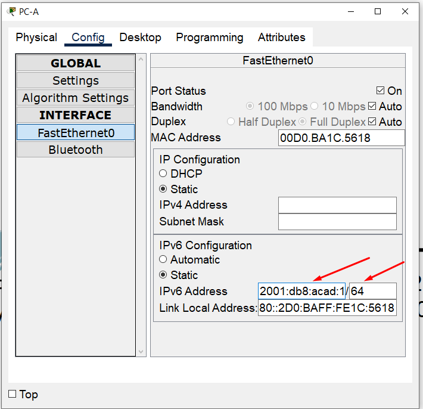
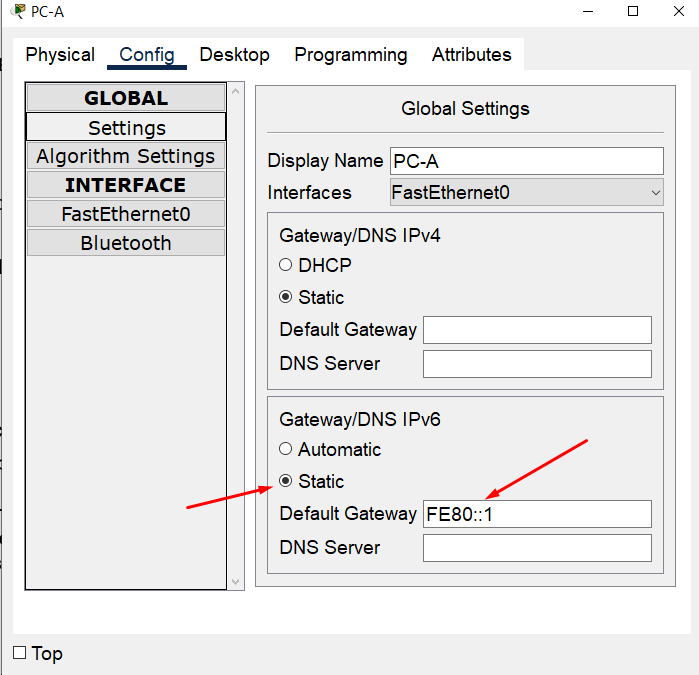
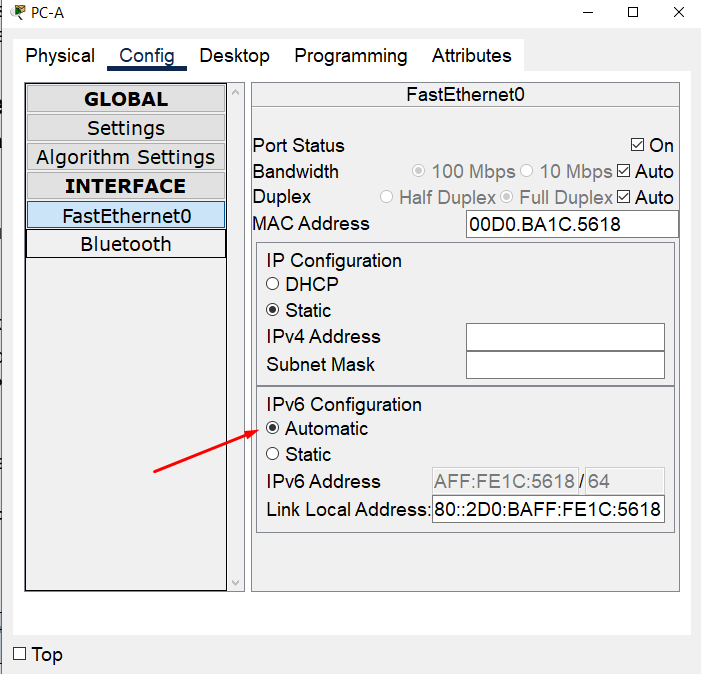
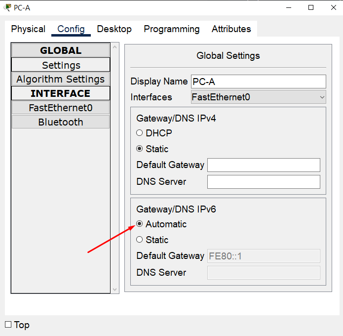

#  Лабораторная работа. Настройка IPv6-адресов на сетевых устройствах

#### Топология


#### Таблица адресации
| Устройство | Интерфейс    | IPv6-адрес            | Link local IPv6-адрес | Длина префикса | Шлюз по умолчанию |
|------------|--------------|-----------------------|-----------------------|----------------|-------------------|
| R1         | G0/0/0       | 2001:db8:acad:a::1    | fe80::1               | 64             | —                 |
| R1         | G0/0/1       | 2001:db8:acad:1::1    | fe80::1               | 64             | —                 |
| S1         | VLAN 1       | 2001:db8:acad:1::b    | fe80::b               | 64             | —                 |
| PC-A       | NIC          | 2001:db8:acad:1::3    | SLACC                 | 64             | fe80::1           |
| PC-B       | NIC          | 2001:db8:acad:a::3    | SLACC                 | 64             | fe80::1           |
#### Задачи:
1. [Часть 1. Настройка топологии и конфигурация основных параметров маршрутизатора и коммутатора](#часть-1-настройка-топологии-и-конфигурация-основных-параметров-маршрутизатора-и-коммутатора)  
2. [Часть 2. Ручная настройка IPv6-адресов](#часть-2-ручная-настройка-ipv6-адресов)  
3. [Часть 3. Проверка сквозного подключения (статика)](#часть-3-проверка-сквозного-подключения-статика)  
4. [Часть 4. Проверка сквозного подключения (SLAAC)](#часть-4-проверка-сквозного-подключения-slaac)  


### Часть 1. Настройка топологии и конфигурация основных параметров маршрутизатора и коммутатора
Подключаем сеть в соответствии с топологией, настраиваем узлы в соответсвии с топологией, настриваем базовые параметры коммутатора и маршрутизатора

[Итоговый файл cpt для этой лабораторной](./lab_cpt.pkt)

[Пример базовой настройки коммутатора S1](./S1_conf)

[Пример базовой настройки маршрутизатора R1](./R1_conf)

### Часть 2. Ручная настройка IPv6-адресов

### Шаг 1. Назначьте IPv6-адреса интерфейсам Ethernet на R1
Используем команду `ipv6 address 2001:db8:acad:a::1/64` для назначения глобального индивидуального IPv6-адреса на интерфейс gigabitEthernet 0/0/0. И соответственно `ipv6 address 2001:db8:acad:1::1/64` для назначения глобального индивидуального IPv6-адреса на интерфейс gigabitEthernet 0/0/1.

Командой `show ipv6 interface brief` проверям корретность применения:
```
R1#show ipv6 interface brief 
GigabitEthernet0/0/0       [administratively down/down]
    FE80::260:3EFF:FE65:4801
    2001:DB8:ACAD:A::1
GigabitEthernet0/0/1       [administratively down/down]
    FE80::260:3EFF:FE65:4802
    2001:DB8:ACAD:1::1
Vlan1                      [administratively down/down]
    unassigned
```

#### Видим, что адреса применились, порты выключены

Включим порты и изменим LLA:
```
R1(config)#interface gigabitEthernet 0/0/0
R1(config-if)#ipv6 enable
R1(config-if)#no shut
R1(config-if)#ipv6 address fe80::1 link-local 
R1(config-if)#exit
R1(config)#interface gigabitEthernet 0/0/1
R1(config-if)#ipv6 enable
R1(config-if)#no shut
R1(config-if)#ipv6 address fe80::1 link-local 
```

Командой `show ipv6 interface brief` проверям корретность применения:
```
R1#show ipv6 interface brief 
GigabitEthernet0/0/0       [up/up]
    FE80::1
    2001:DB8:ACAD:A::1
GigabitEthernet0/0/1       [up/up]
    FE80::1
    2001:DB8:ACAD:1::1
Vlan1                      [administratively down/down]
    unassigned
```

#### Link local адреса применились, порты включены

Какие группы многоадресной рассылки назначены интерфейсу G0/0?

Проверяем командой `show ipv6 interface gigabitEthernet 0/0/0`:
```
R1#show ipv6 interface gigabitEthernet 0/0/0
GigabitEthernet0/0/0 is up, line protocol is up
  IPv6 is enabled, link-local address is FE80::1
  No Virtual link-local address(es):
  Global unicast address(es):
    2001:DB8:ACAD:A::1, subnet is 2001:DB8:ACAD:A::/64
  Joined group address(es):
    FF02::1
    FF02::1:FF00:1
  MTU is 1500 bytes
  ICMP error messages limited to one every 100 milliseconds
  ICMP redirects are enabled
  ICMP unreachables are sent
  ND DAD is enabled, number of DAD attempts: 1
  ND reachable time is 30000 milliseconds
```
#### Видим 2 группы многоадресной рассылки: FF02::1 - это группа "все хосты в сети", FF02::1:FF00:1 - это автоматическая группа связанная с нашим назначенным глобальным адресом

### Шаг 2. Активируйте IPv6-маршрутизацию на R1

a. На PC-B не назначен индивидуальный IPv6-адрес сетевой интерфейсной карты.

b. Командой `ipv6 unicast-routing` включаем режим роутера (??) IPv6 на R1. 

c. Проверяем PC-B:
```
C:\>ipconfig

FastEthernet0 Connection:(default port)

   Connection-specific DNS Suffix..: 
   Link-local IPv6 Address.........: FE80::201:42FF:FEBD:EE78
   IPv6 Address....................: 2001:DB8:ACAD:A:201:42FF:FEBD:EE78
   IPv4 Address....................: 0.0.0.0
   Subnet Mask.....................: 0.0.0.0
   Default Gateway.................: FE80::1
                                     0.0.0.0
```

#### Видим "IPv6 Address....................: 2001:DB8:ACAD:A:201:42FF:FEBD:EE78"

Почему PC-B получил глобальный префикс маршрутизации и идентификатор подсети, которые вы настроили на R1?

#### Потому что мы настроили R1 как роутер для IPv6, он попал в группу роутеров FF02::2, и по протоколу SLAAC PC-B запросил в мультикастовую группу роутеров префикс сети (в примере ответом был 2001:DB8:ACAD:A::/64). Получив префикс сети, PC-B  сформировал адрес самостоятельно (в данном примере по EUI-64 из своего MAC)

### Шаг 3. Назначьте IPv6-адреса интерфейсу управления (SVI) на S1

Назначаем IPv6 адрес и LLA для S1:
```
S1#configure terminal 
Enter configuration commands, one per line.  End with CNTL/Z.
S1(config)#interface vlan1
S1(config-if)#ipv6 address 2001:db8:acad:1::b/64
S1(config-if)#ipv6 address fe80::b link-local 
S1(config-if)#no sh
```

Проверяем правильность настроек:
```
S1#show ipv6 interface vlan 1
Vlan1 is up, line protocol is up
  IPv6 is enabled, link-local address is FE80::B
  No Virtual link-local address(es):
  Global unicast address(es):
    2001:DB8:ACAD:1::B, subnet is 2001:DB8:ACAD:1::/64
  Joined group address(es):
    FF02::1
    FF02::1:FF00:B
  MTU is 1500 bytes
  ICMP error messages limited to one every 100 milliseconds
  ICMP redirects are enabled
  ICMP unreachables are sent
  Output features: Check hwidb
  ND DAD is enabled, number of DAD attempts: 1
  ND reachable time is 30000 milliseconds
```
#### Все успешно применилось!

### Шаг 4. Назначьте компьютерам статические IPv6-адреса

Назначим PC-A статический глобальный адрес IPv6:



И статический шлюз по умолчанию:



```
C:\>ipconfig

FastEthernet0 Connection:(default port)

   Connection-specific DNS Suffix..: 
   Link-local IPv6 Address.........: FE80::2D0:BAFF:FE1C:5618
   IPv6 Address....................: 2001:DB8:ACAD:1::3
   IPv4 Address....................: 0.0.0.0
   Subnet Mask.....................: 0.0.0.0
   Default Gateway.................: FE80::1
                                     0.0.0.0

```

Аналогично для PC-B:
```
C:\>ipconfig

FastEthernet0 Connection:(default port)

   Connection-specific DNS Suffix..: 
   Link-local IPv6 Address.........: FE80::201:42FF:FEBD:EE78
   IPv6 Address....................: 2001:DB8:ACAD:A::3
   IPv4 Address....................: 0.0.0.0
   Subnet Mask.....................: 0.0.0.0
   Default Gateway.................: FE80::1
                                     0.0.0.0
```

### Часть 3. Проверка сквозного подключения (статика)

C PC-A отправим эхо-запрос на FE80::1:
```
C:\>ping FE80::1

Pinging FE80::1 with 32 bytes of data:

Reply from FE80::1: bytes=32 time<1ms TTL=255
Reply from FE80::1: bytes=32 time<1ms TTL=255
```


Отправим эхо-запрос на интерфейс управления S1 с PC-A:
```
C:\>ping fe80::b

Pinging fe80::b with 32 bytes of data:

Reply from FE80::B: bytes=32 time=2005ms TTL=255
Reply from FE80::B: bytes=32 time<1ms TTL=255
Reply from FE80::B: bytes=32 time<1ms TTL=255
```

Введем команду tracert на PC-A к PC-B:
```
C:\>tracert 2001:db8:acad:a::3

Tracing route to 2001:db8:acad:a::3 over a maximum of 30 hops: 

  1   0 ms      0 ms      0 ms      2001:DB8:ACAD:1::1
  2   0 ms      0 ms      0 ms      2001:DB8:ACAD:A::3

Trace complete.
```

#### Все успешно!

### Часть 4. Проверка сквозного подключения (SLAAC)

### Теперь повторим на SLAAC адресах:

Назначим PC-A SLAAC глобальный адрес IPv6:




```
C:\>ipconfig

FastEthernet0 Connection:(default port)

   Connection-specific DNS Suffix..: 
   Link-local IPv6 Address.........: FE80::2D0:BAFF:FE1C:5618
   IPv6 Address....................: 2001:DB8:ACAD:1:2D0:BAFF:FE1C:5618
   IPv4 Address....................: 0.0.0.0
   Subnet Mask.....................: 0.0.0.0
   Default Gateway.................: FE80::1
                                     0.0.0.0
```

Аналогично для PC-B:
```
C:\>ipconfig

FastEthernet0 Connection:(default port)

   Connection-specific DNS Suffix..: 
   Link-local IPv6 Address.........: FE80::201:42FF:FEBD:EE78
   IPv6 Address....................: 2001:DB8:ACAD:A:201:42FF:FEBD:EE78
   IPv4 Address....................: 0.0.0.0
   Subnet Mask.....................: 0.0.0.0
   Default Gateway.................: FE80::1
                                     0.0.0.0
```

### Проверка сквозного подключения

C PC-A отправим эхо-запрос на FE80::1:
```
C:\>ping FE80::1

Pinging FE80::1 with 32 bytes of data:

Reply from FE80::1: bytes=32 time<1ms TTL=255
Reply from FE80::1: bytes=32 time<1ms TTL=255
Reply from FE80::1: bytes=32 time<1ms TTL=255
Reply from FE80::1: bytes=32 time<1ms TTL=255

Ping statistics for FE80::1:
    Packets: Sent = 4, Received = 4, Lost = 0 (0% loss),
Approximate round trip times in milli-seconds:
    Minimum = 0ms, Maximum = 0ms, Average = 0ms
```


Отправим эхо-запрос на интерфейс управления S1 с PC-A:
```
C:\>ping fe80::b

Pinging fe80::b with 32 bytes of data:

Reply from FE80::B: bytes=32 time=6ms TTL=255
Reply from FE80::B: bytes=32 time<1ms TTL=255
Reply from FE80::B: bytes=32 time<1ms TTL=255
Reply from FE80::B: bytes=32 time<1ms TTL=255

Ping statistics for FE80::B:
    Packets: Sent = 4, Received = 4, Lost = 0 (0% loss),
Approximate round trip times in milli-seconds:
    Minimum = 0ms, Maximum = 6ms, Average = 1ms
```

Введем команду tracert на PC-A к PC-B:
```
C:\>tracert 2001:DB8:ACAD:A:201:42FF:FEBD:EE78

Tracing route to 2001:DB8:ACAD:A:201:42FF:FEBD:EE78 over a maximum of 30 hops: 

  1   0 ms      0 ms      0 ms      2001:DB8:ACAD:1::1
  2   0 ms      0 ms      0 ms      2001:DB8:ACAD:A:201:42FF:FEBD:EE78

Trace complete.
```

#### Все успешно!
