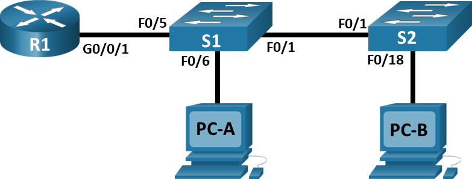

#  Лабораторная работа - Внедрение маршрутизации между виртуальными локальными сетями 
#### Топология


#### Таблица адресации
| Устройство | Интерфейс      | IP-адрес      | Маска подсети   | Шлюз по умолчанию |
|------------|----------------|---------------|-----------------|-------------------|
| R1         | G0/0/1.10      | 192.168.10.1  | 255.255.255.0   | —                 |
| R1         | G0/0/1.20      | 192.168.20.1  | 255.255.255.0   | —                 |
| R1         | G0/0/1.30      | 192.168.30.1  | 255.255.255.0   | —                 |
| R1         | G0/0/1.1000    | —             | —               | —                 |
| S1         | VLAN 10        | 192.168.10.11 | 255.255.255.0   | 192.168.10.1      |
| S2         | VLAN 10        | 192.168.10.12 | 255.255.255.0   | 192.168.10.1      |
| PC-A       | NIC            | 192.168.20.3  | 255.255.255.0   | 192.168.20.1      |
| PC-B       | NIC            | 192.168.30.3  | 255.255.255.0   | 192.168.30.1      |
#### Таблица VLAN
| VLAN  | Имя          | Назначенный интерфейс                                      |
|-------|--------------|-----------------------------------------------------------|
| 10    | Управление   | S1: VLAN 10<br>S2: VLAN 10                                 |
| 20    | Sales        | S1: F0/6                                                  |
| 30    | Operations   | S2: F0/18                                                 |
| 999   | Parking_Lot  | С1: F0/2-4, F0/7-24, G0/1-2<br>С2: F0/2-17, F0/19-24, G0/1-2 |
| 1000  | Собственная  | —                                                         |


#### Задачи:
- [Часть 1. Создание сети и настройка основных параметров устройства](#часть-1-создание-сети-и-настройка-основных-параметров-устройства)
- [Часть 2. Создание сетей VLAN и назначение портов коммутатора](#часть-2-создание-сетей-vlan-и-назначение-портов-коммутатора)
- [Часть 3. Настройка транка 802.1Q между коммутаторами](#часть-3-настройка-транка-8021q-между-коммутаторами)
- [Часть 4. Настройка маршрутизации между сетями VLAN](#часть-4-настройка-маршрутизации-между-сетями-vlan)
- [Часть 5. Проверка, что маршрутизация между VLAN работает](#часть-5-проверка-что-маршрутизация-между-vlan-работает)


### Часть 1. Создание сети и настройка основных параметров устройства
Подключаем сеть в соответствии с топологией, настраиваем узлы в соответсвии с топологией, настриваем базовые параметры коммутатора и маршрутизатора

[Итоговый файл cpt для этой лабораторной](./lab_cpt.pkt)


[Базовая настройка маршрутизатора R1](./R1_conf)

[Базовая настройка маршрутизатора S1](./S1_conf)

[Базовая настройка маршрутизатора S2](./S2_conf)

### Часть 2. Создание сетей VLAN и назначение портов коммутатора

### Шаг 1. Создайте сети VLAN на коммутаторах
a. Создаем VLAN на коммутаторе S1:
```
S1(config)#vlan 10
S1(config-vlan)#name MANAGEMENT
S1(config-vlan)#exit
S1(config)#vlan 20
S1(config-vlan)#name Sales
S1(config-vlan)#vlan 30
S1(config-vlan)#name Operations
S1(config-vlan)#exit
S1(config)#vlan 999
S1(config-vlan)#name Parking_Lot
```
Повторяем для S2.

b.	Настройте интерфейс управления и шлюз по умолчанию на каждом коммутаторе, используя информацию об IP-адресе в таблице адресации
```
S1(config)#interface vlan 10
S1(config-if)#
%LINK-5-CHANGED: Interface Vlan10, changed state to up
S1(config-if)#ip address 192.168.10.11 255.255.255.0
S1(config-if)#exit
S1(config)#ip default-gateway 192.168.10.1
```
Повторяем для S2.

c.	Назначьте все неиспользуемые порты коммутатора VLAN Parking_Lot, настройте их для статического режима доступа и административно деактивируйте их
```
S1(config)#interface range fa0/2-4,fa0/7-24,g0/1-2
S1(config-if-range)#switchport mode access 
S1(config-if-range)#switchport access vlan 999
S1(config-if-range)#shutdown 
```
Повторяем для S2.

### Шаг 2. Назначьте сети VLAN соответствующим интерфейсам коммутатора
Настраиваем порт на S1 и проверяем что все ок:
```
S1(config)#interface f0/6
S1(config-if)#sw m a
S1(config-if)#sw a v 20
S1(config-if)#^Z
S1#
%SYS-5-CONFIG_I: Configured from console by console

S1#sho vlan bri
S1#sho vlan brief 

VLAN Name                             Status    Ports
---- -------------------------------- --------- -------------------------------
1    default                          active    Fa0/1, Fa0/5
10   MANAGEMENT                       active    
20   Sales                            active    Fa0/6
30   Operations                       active    
999  Parking_Lot                      active    Fa0/2, Fa0/3, Fa0/4, Fa0/7
                                                Fa0/8, Fa0/9, Fa0/10, Fa0/11
                                                Fa0/12, Fa0/13, Fa0/14, Fa0/15
                                                Fa0/16, Fa0/17, Fa0/18, Fa0/19
                                                Fa0/20, Fa0/21, Fa0/22, Fa0/23
                                                Fa0/24, Gig0/1, Gig0/2
1002 fddi-default                     active    
1003 token-ring-default               active    
1004 fddinet-default                  active    
1005 trnet-default                    active    
```
Все удачно!
Делаем аналогично для S2 с его портом и VLAN

## Часть 3. Настройка транка 802.1Q между коммутаторами


### Шаг 1. Вручную настройте магистральный интерфейс F0/1 на коммутаторах S1 и S2

```
S1(config)#interface f0/1
S1(config-if)#switchport mode trunk 
S1(config-if)#switchport trunk native vlan 1000
S1(config-if)#switchport trunk allowed vlan 10,20,30,1000

! Проверяем что все ок

S1#show interfaces f0/1 switchport 
Name: Fa0/1
Switchport: Enabled
Administrative Mode: trunk
Operational Mode: trunk
Administrative Trunking Encapsulation: dot1q
Operational Trunking Encapsulation: dot1q
Negotiation of Trunking: On
Access Mode VLAN: 1 (default)
Trunking Native Mode VLAN: 1000 (Inactive)
Voice VLAN: none
Administrative private-vlan host-association: none
Administrative private-vlan mapping: none
Administrative private-vlan trunk native VLAN: none
Administrative private-vlan trunk encapsulation: dot1q
Administrative private-vlan trunk normal VLANs: none
Administrative private-vlan trunk private VLANs: none
Operational private-vlan: none
Trunking VLANs Enabled: 10,20,30,1000
Pruning VLANs Enabled: 2-1001
Capture Mode Disabled
Capture VLANs Allowed: ALL
Protected: false
Unknown unicast blocked: disabled
Unknown multicast blocked: disabled
Appliance trust: none
```
Все ок, повторяем для S2

### Шаг 2. Вручную настройте магистральный интерфейс F0/5 на коммутаторе S1
Настраиваем f0/5 так же как f0/1 и сохраняем настройки
```
S1(config)#interface f0/5
S1(config-if)#switchport mode trunk 
S1(config-if)#switchport trunk native vlan 1000
S1(config-if)#switchport trunk allowed vlan 10,20,30,1000
S1(config-if)#^Z
S1#copy running-config startup-config 
Destination filename [startup-config]? 
Building configuration...
[OK]
```

Вопрос: Что произойдет, если G0/0/1 на R1 будет отключен?

Ответ: f0/5 на S1 так же выключится


## Часть 4. Настройка маршрутизации между сетями VLAN
### Шаг 1. Настройте маршрутизатор
```
! Включаем порт
R1(config)#interface g0/0/1
R1(config-if)#no sh

! Настраиваем подинтерфейсы
R1(config)#interface gigabitEthernet 0/0/1.10
R1(config-subif)#
%LINK-5-CHANGED: Interface GigabitEthernet0/0/1.10, changed state to up

%LINEPROTO-5-UPDOWN: Line protocol on Interface GigabitEthernet0/0/1.10, changed state to up

R1(config-subif)#encapsulation dot1Q 10
R1(config-subif)#ip address 192.168.10.1 255.255.255.0 
R1(config-subif)#description MANAGEMENT
R1(config-subif)#exit

R1(config)#interface gigabitEthernet 0/0/1.20
R1(config-subif)#description Sales
R1(config-subif)#encapsulation dot1Q 20
R1(config-subif)#ip address 192.168.20.1 255.255.255.0

R1(config)#interface gigabitEthernet 0/0/1.30
R1(config-subif)#description Operations
R1(config-subif)#encapsulation dot1Q 30
R1(config-subif)#ip ad 192.168.30.1 255.255.255.0

!Проверяем что все применилось show run
interface GigabitEthernet0/0/1
 no ip address
 duplex auto
 speed auto
!
interface GigabitEthernet0/0/1.10
 description MANAGEMENT
 encapsulation dot1Q 10
 ip address 192.168.10.1 255.255.255.0
!
interface GigabitEthernet0/0/1.20
 description Sales
 encapsulation dot1Q 20
 ip address 192.168.20.1 255.255.255.0
!
interface GigabitEthernet0/0/1.30
 description Operations
 encapsulation dot1Q 30
 ip address 192.168.30.1 255.255.255.0
!
interface GigabitEthernet0/0/1.1000
 encapsulation dot1Q 1000 native
 no ip address
```
Все примениль, как убедится, что вспомогательные интерфейсы работают не ЗНАЮ

## Часть 5. Проверка, что маршрутизация между VLAN работает
### Шаг 1. Выполните следующие тесты с PC-A. Все должно быть успешно.
```
Cisco Packet Tracer PC Command Line 1.0
! Пингуем шлюз по умолчанию с PC-A

C:\>ping 192.168.20.1

Pinging 192.168.20.1 with 32 bytes of data:

Reply from 192.168.20.1: bytes=32 time<1ms TTL=255
Reply from 192.168.20.1: bytes=32 time<1ms TTL=255
Reply from 192.168.20.1: bytes=32 time<1ms TTL=255

Ping statistics for 192.168.20.1:
    Packets: Sent = 3, Received = 3, Lost = 0 (0% loss),
Approximate round trip times in milli-seconds:
    Minimum = 0ms, Maximum = 0ms, Average = 0ms

Control-C
^C

! Все успешно!

! Пингуем шлюз PC-B

C:\>ping 192.168.30.3

Pinging 192.168.30.3 with 32 bytes of data:

Request timed out.
Reply from 192.168.30.3: bytes=32 time<1ms TTL=127
Reply from 192.168.30.3: bytes=32 time<1ms TTL=127
Reply from 192.168.30.3: bytes=32 time<1ms TTL=127

Ping statistics for 192.168.30.3:
    Packets: Sent = 4, Received = 3, Lost = 1 (25% loss),
Approximate round trip times in milli-seconds:
    Minimum = 0ms, Maximum = 0ms, Average = 0ms

! Пингуем коммутатор S2

C:\>ping 192.168.10.12

Pinging 192.168.10.12 with 32 bytes of data:

Request timed out.
Request timed out.
Reply from 192.168.10.12: bytes=32 time<1ms TTL=254
Reply from 192.168.10.12: bytes=32 time<1ms TTL=254

Ping statistics for 192.168.10.12:
    Packets: Sent = 4, Received = 2, Lost = 2 (50% loss),
Approximate round trip times in milli-seconds:
    Minimum = 0ms, Maximum = 0ms, Average = 0ms
```
Ура, все работает!

### Шаг 2. Пройдите следующий тест с PC-B
```
C:\>tracert 192.168.20.3

Tracing route to 192.168.20.3 over a maximum of 30 hops: 

  1   0 ms      5 ms      0 ms      192.168.30.1
  2   0 ms      0 ms      0 ms      192.168.20.3

Trace complete.
```

Видим адрес шлюза (маршрутизатор R1) и PC-A