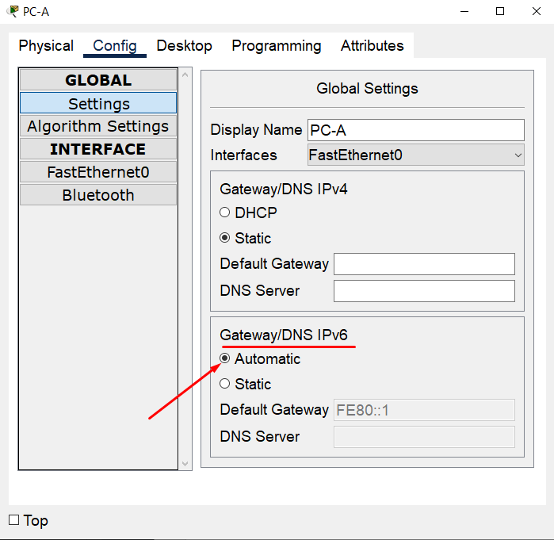

#  Лабораторная работа - Настройка DHCPv6
#### Топология


#### Таблица адресации
| Устройство | Интерфейс  | IPv6-адрес               |
|------------|------------|--------------------------|
| R1         | G0/0/0     | 2001:db8:acad:2::1/64    |
|            |            | fe80::1                  |
| R1         | G0/0/1     | 2001:db8:acad:1::1/64    |
|            |            | fe80::1                  |
| R2         | G0/0/0     | 2001:db8:acad:2::2/64    |
|            |            | fe80::2                  |
| R2         | G0/0/1     | 2001:db8:acad:3::1/64    |
|            |            | fe80::1                  |
| PC-A       | NIC        | DHCP                     |
| PC-B       | NIC        | DHCP                     |

#### Задачи:
- [Часть 1. Создание сети и настройка основных параметров устройства](#часть-1-создание-сети-и-настройка-основных-параметров-устройства)
- [Часть 2. Проверка назначения адреса SLAAC от R1](#часть-2-проверка-назначения-адреса-slaac-от-r1)
- [Часть 3. Настройка и проверка сервера DHCPv6 без гражданства на R1](#часть-3-настройка-и-проверка-сервера-dhcpv6-без-гражданства-на-r1)
- [Часть 4. Настройка и проверка состояния DHCPv6 сервера на R1](#часть-4-настройка-и-проверка-состояния-dhcpv6-сервера-на-r1)
- [Часть 5. Настройка и проверка DHCPv6 Relay на R2](#часть-5-настройка-и-проверка-dhcpv6-relay-на-r2)


### Часть 1. Создание сети и настройка основных параметров устройства
Подключаем сеть в соответствии с топологией, настраиваем узлы в соответсвии с топологией, настраиваем базовые параметры коммутаторов и маршрутизаторов. Указывает ipv6 адреса из таблицы, включает ipv6 маршрутизацию

[Итоговый файл cpt для этой лабораторной](./lab_cpt.pkt)

[Базовая настройка коммутатора S1](./S1_conf)

[Базовая настройка коммутатора S2](./S2_conf)

[Базовая настройка маршрутизатора R1](./R1_conf)

[Базовая настройка маршрутизатора R2](./R2_conf)


Проверяем связность с помощью пинга адреса G0/0/1 R2 из R1:
```
R1#ping 2001:db8:acad:3::1

Type escape sequence to abort.
Sending 5, 100-byte ICMP Echos to 2001:db8:acad:3::1, timeout is 2 seconds:
!!!!!
Success rate is 100 percent (5/5), round-trip min/avg/max = 0/0/0 ms
```

Все успешно!

### Часть 2. Проверка назначения адреса SLAAC от R1

Включите PC-A и убедитесь, что сетевой адаптер настроен для автоматической настройки IPv6:

Результат команды ipconfig показывает, что PC-A присвоил себе адрес из сети 2001:db8:1::/64
```
C:\>ipconfig

FastEthernet0 Connection:(default port)

   Connection-specific DNS Suffix..: 
   Link-local IPv6 Address.........: FE80::260:47FF:FE0A:B4B5
   IPv6 Address....................: 2001:DB8:ACAD:1:260:47FF:FE0A:B4B5
   IPv4 Address....................: 0.0.0.0
   Subnet Mask.....................: 0.0.0.0
   Default Gateway.................: FE80::1
                                     0.0.0.0
```


Вопрос: Откуда взялась часть адреса с идентификатором хоста?

Ответ: сгенерирован на основе MAC-адреса (добавление FFFE в середину MAC-адреса)

### Часть 3. Настройка и проверка сервера DHCPv6 без гражданства на R1


### Шаг 1. Более подробно изучим конфигурацию PC-A
a.	Выполните команду ipconfig /all на PC-A и посмотрим на результат
```
C:\>ipconfig /all

FastEthernet0 Connection:(default port)

   Connection-specific DNS Suffix..: 
   Physical Address................: 0060.470A.B4B5
   Link-local IPv6 Address.........: FE80::260:47FF:FE0A:B4B5
   IPv6 Address....................: 2001:DB8:ACAD:1:260:47FF:FE0A:B4B5
   IPv4 Address....................: 0.0.0.0
   Subnet Mask.....................: 0.0.0.0
   Default Gateway.................: FE80::1
                                     0.0.0.0
   DHCP Servers....................: 0.0.0.0
   DHCPv6 IAID.....................: 
   DHCPv6 Client DUID..............: 00-01-00-01-D4-A3-EB-41-00-60-47-0A-B4-B5
   DNS Servers.....................: ::
                                     0.0.0.0
```
DNS-сервера нет

### Шаг 2. Настроим R1 для предоставления DHCPv6 без состояния для PC-A.

Создаем пул DHCP IPv6 на R1 с именем R1-STATELESS:
```
R1(config)#ipv6 dhcp pool R1-STATELESS
R1(config-dhcpv6)#dns-server 2001:db8:acad::254
R1(config-dhcpv6)#domain-name STATELESS.com
```
Настроим интерфейс G0/0/1 на R1, чтобы предоставить флаг конфигурации OTHER для локальной сети R1 и укажем только что созданный пул DHCP в качестве ресурса DHCP для этого интерфейса:
```
R1(config)# interface g0/0/1
R1(config-if)#ipv6 nd other-config-flag 
R1(config-if)#ipv6 dhcp server R1-STATELESS
```
Сохраняем конфигурациюю и перезапускаем PC-A:
```
C:\>ipconfig /all

FastEthernet0 Connection:(default port)

   Connection-specific DNS Suffix..: STATELESS.com 
   Physical Address................: 0060.470A.B4B5
   Link-local IPv6 Address.........: FE80::260:47FF:FE0A:B4B5
   IPv6 Address....................: 2001:DB8:ACAD:1:260:47FF:FE0A:B4B5
   IPv4 Address....................: 0.0.0.0
   Subnet Mask.....................: 0.0.0.0
   Default Gateway.................: FE80::1
                                     0.0.0.0
   DHCP Servers....................: 0.0.0.0
   DHCPv6 IAID.....................: 522232587
   DHCPv6 Client DUID..............: 00-01-00-01-D4-A3-EB-41-00-60-47-0A-B4-B5
   DNS Servers.....................: 2001:DB8:ACAD::254
                                     0.0.0.0
```
Ура, DNS появился!

Проверим связь с помощью пинга IP-адреса интерфейса G0/1 R2:
```
C:\>ping 2001:db8:acad:3::1

Pinging 2001:db8:acad:3::1 with 32 bytes of data:

Reply from 2001:DB8:ACAD:3::1: bytes=32 time<1ms TTL=254
Reply from 2001:DB8:ACAD:3::1: bytes=32 time<1ms TTL=254
Reply from 2001:DB8:ACAD:3::1: bytes=32 time<1ms TTL=254
Reply from 2001:DB8:ACAD:3::1: bytes=32 time<1ms TTL=254

Ping statistics for 2001:DB8:ACAD:3::1:
    Packets: Sent = 4, Received = 4, Lost = 0 (0% loss),
Approximate round trip times in milli-seconds:
    Minimum = 0ms, Maximum = 0ms, Average = 0ms
```
Связь есть, все хорошо)

### Часть 4. Настройка и проверка состояния DHCPv6 сервера на R1

Создадим пул DHCPv6 на R1 для сети 2001:db8:acad:3:aaa::/80. Это предоставит адреса локальной сети, подключенной к интерфейсу G0/0/1 на R2. В составе пула зададим DNS-сервер 2001:db8:acad: :254 и доменное имя STATEFUL.com:
```
R1(config)#ipv6 dhcp pool R2-STATEFUL
R1(config-dhcpv6)#address prefix 2001:db8:acad:3:aaa::/80
R1(config-dhcpv6)#dns-server 2001:db8:acad::254
R1(config-dhcpv6)#domain-name STATEFUL.com
```
Назначим только что созданный пул DHCPv6 интерфейсу g0/0/0 на R1:
```
R1(config)#inte g0/0/0
R1(config-if)#ipv6 dhcp server R2-STATEFUL
```

### Часть 5. Настройка и проверка DHCPv6 Relay на R2
### Шаг 1. Включим PC-B и проверим адрес SLAAC, который он генерирует:
```
C:\>ipconfig /all

FastEthernet0 Connection:(default port)

   Connection-specific DNS Suffix..: 
   Physical Address................: 0009.7CAC.B8B8
   Link-local IPv6 Address.........: FE80::209:7CFF:FEAC:B8B8
   IPv6 Address....................: 2001:DB8:ACAD:3:209:7CFF:FEAC:B8B8
   IPv4 Address....................: 0.0.0.0
   Subnet Mask.....................: 0.0.0.0
   Default Gateway.................: FE80::1
                                     0.0.0.0
   DHCP Servers....................: 0.0.0.0
   DHCPv6 IAID.....................: 
   DHCPv6 Client DUID..............: 00-01-00-01-B3-51-03-9C-00-09-7C-AC-B8-B8
   DNS Servers.....................: ::
                                     0.0.0.0
```
IPv6 адрес раздался с R2

### Шаг 2. Настроим R2 в качестве агента DHCP-ретрансляции для локальной сети на G0/0/1:
```
R2(config)#interface g0/0/1
R2(config-if)#ipv6 nd managed-config-flag
R2(config-if)#ipv6 dhcp relay destination 2001:db8:acad:2::1 g0/0/0
                        ^
% Invalid input detected at '^' marker.
R2(config-if)#ipv6 dhcp ?
  client  Act as an IPv6 DHCP client
  server  Act as an IPv6 DHCP server
```
Команда relay в CPT не работает, но по идее должно (но это не точно, что не работает, а не что должно)

### Шаг 3. Попытка получить адрес IPv6 из DHCPv6 на PC-B.

Откроем командную строку на PC-B и выполним команду ipconfig /all и проверим выходные данные, чтобы увидеть результаты операции ретрансляции DHCPv6 (но не работает из-за причин в шаге 2)
```
C:\>ipconfig /all

FastEthernet0 Connection:(default port)

   Connection-specific DNS Suffix..: 
   Physical Address................: 0009.7CAC.B8B8
   Link-local IPv6 Address.........: FE80::209:7CFF:FEAC:B8B8
   IPv6 Address....................: ::
   IPv4 Address....................: 0.0.0.0
   Subnet Mask.....................: 0.0.0.0
   Default Gateway.................: FE80::1
                                     0.0.0.0
   DHCP Servers....................: 0.0.0.0
   DHCPv6 IAID.....................: 328692804
   DHCPv6 Client DUID..............: 00-01-00-01-B3-51-03-9C-00-09-7C-AC-B8-B8
   DNS Servers.....................: ::
                                     0.0.0.0
```
По идее выше должны быть адреса из пула R2-STATEFUL на R1