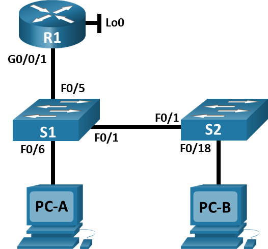

#  Лабораторная работа - Конфигурация безопасности коммутатора
#### Топология


[Итоговый файл cpt для этой лабораторной](./lab_cpt.pkt)

#### Таблица адресации
| Устройство | Interface/VLAN  | IP-адрес        | Маска подсети    |
|------------|-----------------|-----------------|------------------|
| R1         | G0/0/1          | 192.168.10.1    | 255.255.255.0    |
|            | Loopback 0      | 10.10.1.1       | 255.255.255.0    |
| S1         | VLAN 10         | 192.168.10.201  | 255.255.255.0    |
| S2         | VLAN 10         | 192.168.10.202  | 255.255.255.0    |
| PC A       | NIC             | DHCP            | 255.255.255.0    |
| PC B       | NIC             | DHCP            | 255.255.255.0    |

#### Задачи:
1. [Часть 1. Настройка основного сетевого устройства](#часть-1-настройка-основного-сетевого-устройства)
2. [Часть 2. Настройка сетей VLAN](#часть-2-настройка-сетей-vlan)
3. [Часть 3. Настройки безопасности коммутатора](#часть-3-настройки-безопасности-коммутатора)


### Часть 1. Настройка основного сетевого устройства
##### Подключаем сеть в соответствии с топологией, заливаем конфиг на R1, настраиваем базовые параметры коммутаторов в соотвествии в заданием

[Настройка коммутатора S1](./S1_conf)

[Настройка коммутатора S2](./S2_conf)

### Часть 2. Настройка сетей VLAN
##### Создаем вланы на S1
```
S1(config)#vlan 10
S1(config-vlan)#name
S1(config-vlan)#name Management
S1(config-vlan)#ex
S1(config)#interface vlan 10
S1(config-if)#ip address 192.168.10.201 255.255.255.0
S1(config-if)#ex
S1(config)#vlan 333
S1(config-vlan)#name Native
S1(config-vlan)#ex
S1(config)#vlan 999
S1(config-vlan)#name ParkingLot
```
Повторяем для S2.

### Часть 3. Настройки безопасности коммутатора
#### Шаг 1. Релизация магистральных соединений 802.1Q.
##### Настроим транки на коммутаторах:
```
S1(config)#interface fa0/1
S1(config-if)#sw mode tru
S1(config-if)#sw trunk native vlan 333
```
Аналогично для S2.

##### Отключаем согласование DTP на fa0/1:
```
S1(config)#interface fa0/1
S1(config-if)#switchport nonegotiate 
```
Аналогично для S2.

##### Проверим применение настроек:
```
S1#show interfaces fa0/1 switchport 
Name: Fa0/1
Switchport: Enabled
Administrative Mode: trunk
Operational Mode: trunk
Administrative Trunking Encapsulation: dot1q
Operational Trunking Encapsulation: dot1q
Negotiation of Trunking: Off
```
Все применилось!

####  Шаг 2. Настройка портов доступа
##### Настраиваем порты доступа
```
S1(config)#interface ra f0/5-6
S1(config-if-range)#sw mo ac
S1(config-if-range)#sw ac vl 10
```
```
S2(config)#interface fa 0/18
S2(config-if)#sw mo ac
S2(config-if)#sw ac vl 10
```

####  Шаг 3. Безопасность неиспользуемых портов коммутатора
##### Переместим все используемые порты во влан 999 и отключим их:
```
S1(config)#interface range fa0/2-4,f0/7-24,g0/1-2
S1(config-if-range)#sw mo ac
S1(config-if-range)#sw ac vl 999
S1(config-if-range)#shu
```
```
S2(config)#interface range f0/2-17,f0/19-24,g0/1-2
S2(config-if-range)#sw mo ac
S2(config-if-range)#sw ac vl 999
S2(config-if-range)#shu
```

##### Проверим:
```
S1#show interfaces status 
Port      Name               Status       Vlan       Duplex  Speed Type
Fa0/1     TO-S2              connected    trunk      auto    auto  10/100BaseTX
Fa0/2                        disabled 999        auto    auto  10/100BaseTX
Fa0/3                        disabled 999        auto    auto  10/100BaseTX
Fa0/4                        disabled 999        auto    auto  10/100BaseTX
Fa0/5     TO-R1              connected    10         auto    auto  10/100BaseTX
Fa0/6     TO-PC-A            connected    10         auto    auto  10/100BaseTX
Fa0/7                        disabled 999        auto    auto  10/100BaseTX
Fa0/8                        disabled 999        auto    auto  10/100BaseTX
Fa0/9                        disabled 999        auto    auto  10/100BaseTX
Fa0/10                       disabled 999        auto    auto  10/100BaseTX
Fa0/11                       disabled 999        auto    auto  10/100BaseTX
Fa0/12                       disabled 999        auto    auto  10/100BaseTX
Fa0/13                       disabled 999        auto    auto  10/100BaseTX
Fa0/14                       disabled 999        auto    auto  10/100BaseTX
Fa0/15                       disabled 999        auto    auto  10/100BaseTX
Fa0/16                       disabled 999        auto    auto  10/100BaseTX
Fa0/17                       disabled 999        auto    auto  10/100BaseTX
Fa0/18                       disabled 999        auto    auto  10/100BaseTX
Fa0/19                       disabled 999        auto    auto  10/100BaseTX
Fa0/20                       disabled 999        auto    auto  10/100BaseTX
Fa0/21                       disabled 999        auto    auto  10/100BaseTX
Fa0/22                       disabled 999        auto    auto  10/100BaseTX
Fa0/23                       disabled 999        auto    auto  10/100BaseTX
Fa0/24                       disabled 999        auto    auto  10/100BaseTX
Gig0/1                       disabled 999        auto    auto  10/100BaseTX
Gig0/2                       disabled 999        auto    auto  10/100BaseTX
```
Все ок! Аналогично на S2:
```
S2#show interfaces status 
Port      Name               Status       Vlan       Duplex  Speed Type
Fa0/1     TO-S1              connected    trunk      auto    auto  10/100BaseTX
Fa0/2                        disabled 999        auto    auto  10/100BaseTX
Fa0/3                        disabled 999        auto    auto  10/100BaseTX
Fa0/4                        disabled 999        auto    auto  10/100BaseTX
Fa0/5                        disabled 999        auto    auto  10/100BaseTX
Fa0/6                        disabled 999        auto    auto  10/100BaseTX
Fa0/7                        disabled 999        auto    auto  10/100BaseTX
Fa0/8                        disabled 999        auto    auto  10/100BaseTX
Fa0/9                        disabled 999        auto    auto  10/100BaseTX
Fa0/10                       disabled 999        auto    auto  10/100BaseTX
Fa0/11                       disabled 999        auto    auto  10/100BaseTX
Fa0/12                       disabled 999        auto    auto  10/100BaseTX
Fa0/13                       disabled 999        auto    auto  10/100BaseTX
Fa0/14                       disabled 999        auto    auto  10/100BaseTX
Fa0/15                       disabled 999        auto    auto  10/100BaseTX
Fa0/16                       disabled 999        auto    auto  10/100BaseTX
Fa0/17                       disabled 999        auto    auto  10/100BaseTX
Fa0/18    TO-PC-B            connected    10         auto    auto  10/100BaseTX
Fa0/19                       disabled 999        auto    auto  10/100BaseTX
Fa0/20                       disabled 999        auto    auto  10/100BaseTX
Fa0/21                       disabled 999        auto    auto  10/100BaseTX
Fa0/22                       disabled 999        auto    auto  10/100BaseTX
Fa0/23                       disabled 999        auto    auto  10/100BaseTX
Fa0/24                       disabled 999        auto    auto  10/100BaseTX
Gig0/1                       disabled 999        auto    auto  10/100BaseTX
Gig0/2                       disabled 999        auto    auto  10/100BaseTX
```

####  Шаг 4. Документирование и реализация функций безопасности порта

##### Проверим и заполним таблицу со значениями по-умолчанию:

| Функция                          | Настройка по умолчанию       |
|----------------------------------|-----------------------------|
| Защита портов                   | Disabled                   |
| Максимальное количество записей MAC-адресов | 1                          |
| Режим проверки на нарушение безопасности | Shutdown                  |
| Aging Time                       | 0 mins                  |
| Aging Type                       | Absolute                  |
| Secure Static Address Aging      | Disabled                    |
| Sticky MAC Address               | 0                    |

##### Включим защиту с настройками из задания:
```
S1(config)#interface fa0/6
S1(config-if)#sw port-security
S1(config-if)#switchport port-security maximum 3
S1(config-if)#switchport port-security violation restrict 
S1(config-if)#switchport port-security aging time 60
```
Устанавливать тип устаревания CPT не умеет

##### Проверим:
```
S1#show port-security interface f0/6
Port Security              : Enabled
Port Status                : Secure-up
Violation Mode             : Restrict
Aging Time                 : 60 mins
Aging Type                 : Absolute
SecureStatic Address Aging : Disabled
Maximum MAC Addresses      : 3
Total MAC Addresses        : 1
Configured MAC Addresses   : 0
Sticky MAC Addresses       : 0
Last Source Address:Vlan   : 0001.972A.A9B8:10
Security Violation Count   : 0
```
```
S1#show port-security address
               Secure Mac Address Table
-----------------------------------------------------------------------------
Vlan    Mac Address       Type                          Ports   Remaining Age
                                                                   (mins)
----    -----------       ----                          -----   -------------
10	0001.972A.A9B8	DynamicConfigured	FastEthernet0/6		-
-----------------------------------------------------------------------------
Total Addresses in System (excluding one mac per port)     : 0
Max Addresses limit in System (excluding one mac per port) : 1024
```
Все ок!

##### Настроим S2 по заданию:
```
S2(config)#interface fa0/18
S2(config-if)#switchport port-security 
S2(config-if)#switchport port-security maximum 2
S2(config-if)#switchport port-security aging time 60
S2(config-if)#switchport port-security violation pro
S2(config-if)#switchport port-security violation protect 
S2(config-if)#switchport port-security mac-address sticky 
```

##### Проверим:
```
S2#show port-security interface f0/18
Port Security              : Enabled
Port Status                : Secure-up
Violation Mode             : Protect
Aging Time                 : 60 mins
Aging Type                 : Absolute
SecureStatic Address Aging : Disabled
Maximum MAC Addresses      : 2
Total MAC Addresses        : 1
Configured MAC Addresses   : 0
Sticky MAC Addresses       : 1
Last Source Address:Vlan   : 0090.0C22.BB91:10
Security Violation Count   : 0
```
```
S2#show port-security address
               Secure Mac Address Table
-----------------------------------------------------------------------------
Vlan    Mac Address       Type                          Ports   Remaining Age
                                                                   (mins)
----    -----------       ----                          -----   -------------
  10    0090.0C22.BB91    SecureSticky                  Fa0/18       -
-----------------------------------------------------------------------------
Total Addresses in System (excluding one mac per port)     : 0
Max Addresses limit in System (excluding one mac per port) : 1024
```
Все ок!

####  Шаг 5. Реализовать безопасность DHCP snooping
##### Настроим DHCP snooping на S2:
```
S2(config)#ip dhcp snooping 
S2(config)#ip dhcp snooping vlan 10
S2(config)#interface fa0/1
S2(config-if)#ip dhcp snooping trust 
S2(config)#interface fa0/18
S2(config-if)#ip dhcp snooping limit rate 5
```
##### Проверим:
```
S2#show ip dhcp snooping 
Switch DHCP snooping is enabled
DHCP snooping is configured on following VLANs:
10
Insertion of option 82 is enabled
Option 82 on untrusted port is not allowed
Verification of hwaddr field is enabled
Interface                  Trusted    Rate limit (pps)
-----------------------    -------    ----------------
FastEthernet0/1            yes        unlimited       
FastEthernet0/18           no         5 
```
Все ок!

##### На PC-B освободим и обновим IP-адрес и проверими привязку отслеживания DHCP:
Выключим опцию 82 в CPT:
```
S2(config)#no ip dhcp snooping information option 
```
```
S2#show ip dhcp snooping binding
MacAddress          IpAddress        Lease(sec)  Type           VLAN  Interface
------------------  ---------------  ----------  -------------  ----  -----------------
00:01:64:47:D1:63   192.168.10.11    0           dhcp-snooping  10    FastEthernet0/18
Total number of bindings: 1
```
Все ок!

####  Шаг 6. Реализация PortFast и BPDU Guard
##### Включаем portfast и bpduguard на портах доступа:
```
S1(config)#interface fa0/6
S1(config-if)#spanning-tree portfast 
S1(config-if)#spanning-tree bpduguard enable 

S2(config)#interface fa0/18
S2(config-if)#spanning-tree portfast 
S2(config-if)#spanning-tree bpduguard enable 
```
##### Проверим результат:
```
S1#show spanning-tree interface f0/6 detail


Port 6 (FastEthernet0/6) of VLAN0010 is designated forwarding
  Port path cost 19, Port priority 128, Port Identifier 128.6
  Designated root has priority 32778, address 0004.9AE4.ACC6
  Designated bridge has priority 32778, address 00E0.B052.E7CE
  Designated port id is 128.6, designated path cost 19
  Timers: message age 16, forward delay 0, hold 0
  Number of transitions to forwarding state: 1
  The port is in the portfast mode
  Link type is point-to-point by default
```
```
interface FastEthernet0/6
 description TO-PC-A
 switchport access vlan 10
 switchport mode access
 switchport port-security
 switchport port-security maximum 3
 switchport port-security violation restrict 
 switchport port-security aging time 60
 spanning-tree portfast
 spanning-tree bpduguard enable
```

Все применилось успешно!


##### Проверим связь от PC-A до всех устройств:

```
C:\>ping 192.168.10.11

Pinging 192.168.10.11 with 32 bytes of data:

Reply from 192.168.10.11: bytes=32 time<1ms TTL=128

Ping statistics for 192.168.10.11:
    Packets: Sent = 1, Received = 1, Lost = 0 (0% loss),
Approximate round trip times in milli-seconds:
    Minimum = 0ms, Maximum = 0ms, Average = 0ms

Control-C
^C
C:\>ping 192.168.10.1

Pinging 192.168.10.1 with 32 bytes of data:

Reply from 192.168.10.1: bytes=32 time<1ms TTL=255

Ping statistics for 192.168.10.1:
    Packets: Sent = 1, Received = 1, Lost = 0 (0% loss),
Approximate round trip times in milli-seconds:
    Minimum = 0ms, Maximum = 0ms, Average = 0ms

Control-C
^C
C:\>ping 192.168.10.201

Pinging 192.168.10.201 with 32 bytes of data:

Request timed out.
Reply from 192.168.10.201: bytes=32 time<1ms TTL=255

Ping statistics for 192.168.10.201:
    Packets: Sent = 2, Received = 1, Lost = 1 (50% loss),
Approximate round trip times in milli-seconds:
    Minimum = 0ms, Maximum = 0ms, Average = 0ms

Control-C
^C
C:\>ping 192.168.10.202

Pinging 192.168.10.202 with 32 bytes of data:

Request timed out.
Reply from 192.168.10.202: bytes=32 time<1ms TTL=255

Ping statistics for 192.168.10.202:
    Packets: Sent = 2, Received = 1, Lost = 1 (50% loss),
Approximate round trip times in milli-seconds:
    Minimum = 0ms, Maximum = 0ms, Average = 0ms

Control-C
^C
C:\>ping 10.10.1.1

Pinging 10.10.1.1 with 32 bytes of data:

Reply from 10.10.1.1: bytes=32 time<1ms TTL=255
Reply from 10.10.1.1: bytes=32 time<1ms TTL=255

Ping statistics for 10.10.1.1:
    Packets: Sent = 2, Received = 2, Lost = 0 (0% loss),
Approximate round trip times in milli-seconds:
    Minimum = 0ms, Maximum = 0ms, Average = 0ms
```

Все работает, ура!


### Вопросы для повторения
1.	С точки зрения безопасности порта на S2, почему нет значения таймера для оставшегося возраста в минутах, когда было сконфигурировано динамическое обучение - sticky?

Sticky адреса не удаляются автоматически и для них нет таймера. Они будут привязаны в текущей конфигурацци до перезагрузки коммутатора или ручного удаления

2.	Что касается безопасности порта на S2, если вы загружаете скрипт текущей конфигурации на S2, почему порту 18 на PC-B никогда не получит IP-адрес через DHCP?

Не понял вопроса, не могу сказать((

3.	Что касается безопасности порта, в чем разница между типом абсолютного устаревания и типом устаревание по неактивности?

Абсолютный удаляет MAC-адреса по таймеру не учитывая ничего кроме времени, по неактивности - учитывает факты передачи данных с этого MAC-адреса и обновляет время каждый раз.
