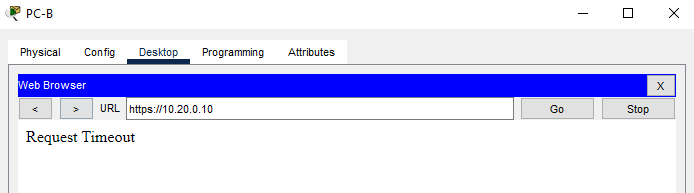
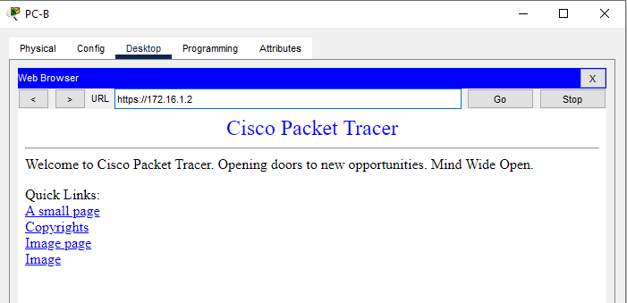

#  Лабораторная работа. Настройка и проверка расширенных списков контроля доступа
#### Топология


[Итоговый файл cpt для этой лабораторной](./lab_cpt.pkt)

#### Таблица адресации
| Устройство | Интерфейс    | IP-адрес   | Маска подсети    | Шлюз по умолчанию |
|------------|--------------|------------|------------------|-------------------|
| **R1**     | G0/0/1       | —          | —                | —                 |
|            | G0/0/1.20    | 10.20.0.1  | 255.255.255.0    | —                 |
|            | G0/0/1.30    | 10.30.0.1  | 255.255.255.0    | —                 |
|            | G0/0/1.40    | 10.40.0.1  | 255.255.255.0    | —                 |
|            | G0/0/1.1000  | —          | —                | —                 |
|            | Loopback1    | 172.16.1.1 | 255.255.255.0    | —                 |
| **R2**     | G0/0/1       | 10.20.0.4  | 255.255.255.0    | —                 |
| **S1**     | VLAN 20      | 10.20.0.2  | 255.255.255.0    | 10.20.0.1         |
| **S2**     | VLAN 20      | 10.20.0.3  | 255.255.255.0    | 10.20.0.1         |
| **PC-A**   | NIC          | 10.30.0.10 | 255.255.255.0    | 10.30.0.1         |
| **PC-B**   | NIC          | 10.40.0.10 | 255.255.255.0    | 10.40.0.1         |

#### Таблица VLAN

| VLAN  | Имя         | Назначенные интерфейсы                                      |
|-------|-------------|------------------------------------------------------------|
| 20    | Management  | S2: F0/5                                                   |
| 30    | Operations  | S1: F0/6                                                   |
| 40    | Sales       | S2: F0/18                                                  |
| 999   | ParkingLot  | S1: F0/2-4, F0/7-24, G0/1-2                               |
|       |             | S2: F0/2-4, F0/6-17, F0/19-24, G0/1-2                     |
| 1000  | Собственная | —                                                          |

#### Задачи:
- [Часть 1. Создание сети и настройка основных параметров устройства](#часть-1-создание-сети-и-настройка-основных-параметров-устройства)
- [Часть 2. Настройка и проверка списков расширенного контроля доступа](#часть-2-настройка-и-проверка-списков-расширенного-контроля-доступа)


### Часть 1. Создание сети и настройка основных параметров устройства
##### Подключаем сеть в соответствии с топологией, настраиваем базовые параметры маршрутизаторов и коммутаторов в соотвествии в заданием

[Базовая настройка маршрутизатора R1](./R1_conf)

[Базовая настройка маршрутизатора R2](./R2_conf)

[Базовая настройка коммутатора S1](./S1_conf)

[Базовая настройка коммутатора S2](./S2_conf)

### Шаг 2. Включите защищенные веб-службы с проверкой подлинности на R1.
т.к. на маршрутизаторе в CPT HTTPS сервер не включается, добавим отдельный https сервер подключенный к коммутатору S1 во влане Management с IP 10.20.0.10 и настроим интерфейс gig0/0/0 с отдельным сервером в сети 172.16.1.0/24

##### Проверим подключения:

```
C:\>ping 10.40.0.10

Pinging 10.40.0.10 with 32 bytes of data:

Reply from 10.40.0.10: bytes=32 time<1ms TTL=127
Reply from 10.40.0.10: bytes=32 time<1ms TTL=127

Ping statistics for 10.40.0.10:
    Packets: Sent = 2, Received = 2, Lost = 0 (0% loss),
Approximate round trip times in milli-seconds:
    Minimum = 0ms, Maximum = 0ms, Average = 0ms

Control-C
^C
C:\>ping 10.20.0.1

Pinging 10.20.0.1 with 32 bytes of data:

Reply from 10.20.0.1: bytes=32 time<1ms TTL=255
Reply from 10.20.0.1: bytes=32 time<1ms TTL=255

Ping statistics for 10.20.0.1:
    Packets: Sent = 2, Received = 2, Lost = 0 (0% loss),
Approximate round trip times in milli-seconds:
    Minimum = 0ms, Maximum = 0ms, Average = 0ms

Control-C
```
```
C:\>ping 10.30.0.10

Pinging 10.30.0.10 with 32 bytes of data:

Reply from 10.30.0.10: bytes=32 time=7ms TTL=127
Reply from 10.30.0.10: bytes=32 time<1ms TTL=127

Ping statistics for 10.30.0.10:
    Packets: Sent = 2, Received = 2, Lost = 0 (0% loss),
Approximate round trip times in milli-seconds:
    Minimum = 0ms, Maximum = 7ms, Average = 3ms

Control-C
^C
C:\>ping 10.20.0.1

Pinging 10.20.0.1 with 32 bytes of data:

Reply from 10.20.0.1: bytes=32 time<1ms TTL=255

Ping statistics for 10.20.0.1:
    Packets: Sent = 1, Received = 1, Lost = 0 (0% loss),
Approximate round trip times in milli-seconds:
    Minimum = 0ms, Maximum = 0ms, Average = 0ms

Control-C
^C
C:\>ping 172.16.1.1

Pinging 172.16.1.1 with 32 bytes of data:

Reply from 172.16.1.1: bytes=32 time<1ms TTL=255

Ping statistics for 172.16.1.1:
    Packets: Sent = 1, Received = 1, Lost = 0 (0% loss),
Approximate round trip times in milli-seconds:
    Minimum = 0ms, Maximum = 0ms, Average = 0ms

Control-C
^C
C:\>ping 10.20.0.1

Pinging 10.20.0.1 with 32 bytes of data:

Reply from 10.20.0.1: bytes=32 time<1ms TTL=255

Ping statistics for 10.20.0.1:
    Packets: Sent = 1, Received = 1, Lost = 0 (0% loss),
Approximate round trip times in milli-seconds:
    Minimum = 0ms, Maximum = 0ms, Average = 0ms

Control-C
^C
C:\>ping 172.16.1.1

Pinging 172.16.1.1 with 32 bytes of data:

Reply from 172.16.1.1: bytes=32 time<1ms TTL=255
Reply from 172.16.1.1: bytes=32 time=4ms TTL=255

Ping statistics for 172.16.1.1:
    Packets: Sent = 2, Received = 2, Lost = 0 (0% loss),
Approximate round trip times in milli-seconds:
    Minimum = 0ms, Maximum = 4ms, Average = 2ms
```


Все ок, все заработает


### Часть 2. Настройка и проверка списков расширенного контроля доступа
##### Шаг 1. Проанализируйте требования к сети и политике безопасности для планирования реализации ACL
Политика1 - запретим исходящий SSH сети Sales в Management

`deny tcp 10.40.0.0 0.0.0.255 10.20.0.0 0.0.0.255 eq 22` 


Политика2 - запртим сети Sales все http\https в Management, на R1, кроме gig0/0/0
```
deny tcp 10.40.0.0 0.0.0.255 10.20.0.0 0.0.0.255 eq 80
deny tcp 10.40.0.0 0.0.0.255 10.20.0.0 0.0.0.255 eq 443

deny tcp 10.40.0.0 0.0.0.255 host 10.30.0.1 eq 80
deny tcp 10.40.0.0 0.0.0.255 host 10.30.0.1 eq 443

deny tcp 10.40.0.0 0.0.0.255 host 10.40.0.1 eq 80
deny tcp 10.40.0.0 0.0.0.255 host 10.40.0.1 eq 443
```

Политика3 - запретим сети Sales ICMP в сети  Operations или Management
```
deny icmp 10.40.0.0 0.0.0.255 10.20.0.0 0.0.0.255 echo
deny icmp 10.40.0.0 0.0.0.255 10.30.0.0 0.0.0.255 echo
```

Политика4 -  запретим сети Operations ICMP в сеть Sales

`deny icmp 10.30.0.0 0.0.0.255 10.40.0.0 0.0.0.255 echo`


##### Шаг 2. Разработка и применение расширенных списков доступа, которые будут соответствовать требованиям политики безопасности.
##### От частного к общему запишем правила в access list для сети Sales:
```
R1(config)#ip access-list extended SALES_RKN
R1(config-ext-nacl)#deny tcp 10.40.0.0 0.0.0.255 10.20.0.0 0.0.0.255 eq 22
R1(config-ext-nacl)#deny tcp 10.40.0.0 0.0.0.255 10.20.0.0 0.0.0.255 eq www
R1(config-ext-nacl)#deny tcp 10.40.0.0 0.0.0.255 10.20.0.0 0.0.0.255 eq 443
R1(config-ext-nacl)#deny tcp 10.40.0.0 0.0.0.255 host 10.30.0.1 eq www
R1(config-ext-nacl)#deny tcp 10.40.0.0 0.0.0.255 host 10.30.0.1 eq 443
R1(config-ext-nacl)#deny tcp 10.40.0.0 0.0.0.255 host 10.40.0.1 eq www
R1(config-ext-nacl)#deny tcp 10.40.0.0 0.0.0.255 host 10.40.0.1 eq 443
R1(config-ext-nacl)#deny icmp 10.40.0.0 0.0.0.255 10.20.0.0 0.0.0.255 echo
R1(config-ext-nacl)#deny icmp 10.40.0.0 0.0.0.255 10.30.0.0 0.0.0.255 echo
R1(config-ext-nacl)#permit ip any any
R1(config-ext-nacl)#deny ip any any
```
##### Навесим этот ACL на входящий интерфейс на R1:
```
R1(config)#interface gigabitEthernet 0/0/1.40
R1(config-subif)#ip access-group SALES_RKN in
```
##### Сделаем второй ACL для сети Operation:
```
R1(config)#ip access-list extended OPERATION_RKN
R1(config-ext-nacl)#deny icmp 10.30.0.0 0.0.0.255 10.40.0.0 0.0.0.255 echo
R1(config-ext-nacl)#permit ip any any
R1(config-ext-nacl)#deny ip any any
```
И привяжем его на входящий на R1:
```
R1(config)#interface gigabitEthernet 0/0/1.30
R1(config-subif)#ip access-group OPERATION_RKN in
```

Проверим ACL:
```
R1#  show ip access-lists 
Extended IP access list SALES_RKN
    10 deny tcp 10.40.0.0 0.0.0.255 10.20.0.0 0.0.0.255 eq 22
    20 deny tcp 10.40.0.0 0.0.0.255 10.20.0.0 0.0.0.255 eq www
    30 deny tcp 10.40.0.0 0.0.0.255 10.20.0.0 0.0.0.255 eq 443
    40 deny tcp 10.40.0.0 0.0.0.255 host 10.30.0.1 eq www
    50 deny tcp 10.40.0.0 0.0.0.255 host 10.30.0.1 eq 443
    60 deny tcp 10.40.0.0 0.0.0.255 host 10.40.0.1 eq www
    70 deny tcp 10.40.0.0 0.0.0.255 host 10.40.0.1 eq 443
    80 deny icmp 10.40.0.0 0.0.0.255 10.20.0.0 0.0.0.255 echo
    90 deny icmp 10.40.0.0 0.0.0.255 10.30.0.0 0.0.0.255 echo
    100 permit ip any any
    110 deny ip any any
Extended IP access list OPERATION_RKN
    10 deny icmp 10.30.0.0 0.0.0.255 10.40.0.0 0.0.0.255 echo
    20 permit ip any any
    30 deny ip any any
```

##### Шаг 3. Убедитесь, что политики безопасности применяются развернутыми списками доступа.
##### C PC-A:
```
C:\>ping 10.40.0.10

Pinging 10.40.0.10 with 32 bytes of data:

Reply from 10.30.0.1: Destination host unreachable.
Reply from 10.30.0.1: Destination host unreachable.
Reply from 10.30.0.1: Destination host unreachable.
Reply from 10.30.0.1: Destination host unreachable.

Ping statistics for 10.40.0.10:
    Packets: Sent = 4, Received = 0, Lost = 4 (100% loss),

C:\>ping 10.20.0.1

Pinging 10.20.0.1 with 32 bytes of data:

Reply from 10.20.0.1: bytes=32 time<1ms TTL=255
Reply from 10.20.0.1: bytes=32 time<1ms TTL=255
Reply from 10.20.0.1: bytes=32 time<1ms TTL=255
Reply from 10.20.0.1: bytes=32 time<1ms TTL=255

Ping statistics for 10.20.0.1:
    Packets: Sent = 4, Received = 4, Lost = 0 (0% loss),
Approximate round trip times in milli-seconds:
    Minimum = 0ms, Maximum = 0ms, Average = 0ms
```
Все ок, по политике

##### C PC-B:

```
C:\>ping 10.30.0.10

Pinging 10.30.0.10 with 32 bytes of data:

Reply from 10.40.0.1: Destination host unreachable.
Reply from 10.40.0.1: Destination host unreachable.

Ping statistics for 10.30.0.10:
    Packets: Sent = 2, Received = 0, Lost = 2 (100% loss),

Control-C
^C
C:\>ping 10.20.0.1

Pinging 10.20.0.1 with 32 bytes of data:

Reply from 10.40.0.1: Destination host unreachable.
Reply from 10.40.0.1: Destination host unreachable.

Ping statistics for 10.20.0.1:
    Packets: Sent = 2, Received = 0, Lost = 2 (100% loss),

Control-C
^C
C:\>ping 172.16.1.1

Pinging 172.16.1.1 with 32 bytes of data:

Reply from 172.16.1.1: bytes=32 time=5ms TTL=255
Reply from 172.16.1.1: bytes=32 time<1ms TTL=255

Ping statistics for 172.16.1.1:
    Packets: Sent = 2, Received = 2, Lost = 0 (0% loss),
Approximate round trip times in milli-seconds:
    Minimum = 0ms, Maximum = 5ms, Average = 2ms

```
C ICMP все правильно!

##### Проверим SSH:
```
C:\>ssh -l SSHadmin 10.20.0.4

% Connection timed out; remote host not responding
C:\>ssh -l SSHadmin 172.16.1.1

Password: 


Unauthorized access is strictly prohibited. 

R1#
```

##### Проверим HTTPS:

Заблокировано, по ТЗ.


Доступно по ТЗ, все ок!