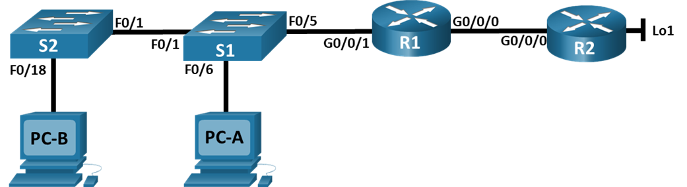

#  Лабораторная работа - Настройка NAT для IPv4
#### Топология


[Итоговый файл cpt для этой лабораторной](./lab_cpt.pkt)

#### Таблица адресации
| Устройство | Интерфейс | IP-адрес       | Маска подсети       |
|------------|-----------|----------------|---------------------|
| R1         | G0/0/0    | 209.165.200.230 | 255.255.255.248     |
| R1         | G0/0/1    | 192.168.1.1     | 255.255.255.0       |
| R2         | G0/0/0    | 209.165.200.225 | 255.255.255.248     |
| R2         | Lo1       | 209.165.200.1   | 255.255.255.224     |
| S1         | VLAN 1    | 192.168.1.11    | 255.255.255.0       |
| S2         | VLAN 1    | 192.168.1.12    | 255.255.255.0       |
| PC-A       | NIC       | 192.168.1.2     | 255.255.255.0       |
| PC-B       | NIC       | 192.168.1.3     | 255.255.255.0       |

#### Задачи:
[Часть 1. Создание сети и настройка основных параметров устройства](#часть-1-создание-сети-и-настройка-основных-параметров-устройства)  
[Часть 2. Настройка и проверка NAT для IPv4](#часть-2-настройка-и-проверка-nat-для-ipv4)  
[Часть 3. Настройка и проверка PAT для IPv4](#часть-3-настройка-и-проверка-pat-для-ipv4)  
[Часть 4. Настройка и проверка статического NAT для IPv4](#часть-4-настройка-и-проверка-статического-nat-для-ipv4)  


### Часть 1. Создание сети и настройка основных параметров устройства
##### Подключаем сеть в соответствии с топологией, настраиваем базовые параметры маршрутизаторов и коммутаторов в соотвествии в заданием

[Базовая настройка маршрутизатора R1](./R1_conf)

[Базовая настройка маршрутизатора R2](./R2_conf)

[Базовая настройка коммутатора S1](./S1_conf)

[Базовая настройка коммутатора S2](./S2_conf)

### Часть 2. Настройка и проверка NAT для IPv4
##### Шаг 1. Настройте NAT на R1, используя пул из трех адресов 209.165.200.226-209.165.200.228
Выполняем в соответсвии с заданием:
```
R1(config)#access-list 1 permit 192.168.1.0 0.0.0.255
R1(config)#ip nat pool PUBLIC_ACCESS 209.165.200.226 209.165.200.228 netmask 255.255.255.248
R1(config)#ip nat inside source list 1 pool PUBLIC_ACCESS 
R1(config)#interface g0/0/1
R1(config-if)#ip nat inside
R1(config-if)#interface g0/0/0
R1(config-if)#ip nat outside
R1(config-if)#
```

##### Шаг 2. Проверьте и проверьте конфигурацию
С PC-B,  запустите эхо-запрос интерфейса Lo1 (209.165.200.1) на R2
```
C:\>ping 209.165.200.1

Pinging 209.165.200.1 with 32 bytes of data:

Request timed out.
Request timed out.
Reply from 209.165.200.1: bytes=32 time<1ms TTL=254
Reply from 209.165.200.1: bytes=32 time<1ms TTL=254

Ping statistics for 209.165.200.1:
    Packets: Sent = 4, Received = 2, Lost = 2 (50% loss),
Approximate round trip times in milli-seconds:
    Minimum = 0ms, Maximum = 0ms, Average = 0ms
```
Ура! Пингуется!

На R1 отобразите таблицу NAT на R1 с помощью команды show ip nat translations:
```
R1#show ip nat translations
Pro  Inside global     Inside local       Outside local      Outside global
icmp 209.165.200.226:10192.168.1.3:10     209.165.200.1:10   209.165.200.1:10
icmp 209.165.200.226:11192.168.1.3:11     209.165.200.1:11   209.165.200.1:11
icmp 209.165.200.226:12192.168.1.3:12     209.165.200.1:12   209.165.200.1:12
icmp 209.165.200.226:9 192.168.1.3:9      209.165.200.1:9    209.165.200.1:9
```
Отражены наши нат преобразования

#### Вопрос: Во что был транслирован внутренний локальный адрес PC-B?
#### Ответ: Во внутренний глобальный, 209.165.200.226
 
#### Вопрос: Какой тип адреса NAT является переведенным адресом?
#### Ответ: Не уверен, видимо Inside global (если переведенный - это тот на который перевели)


### С PC-A, запустите  эхо-запрос интерфейса Lo1 (209.165.200.1) на R2:
```
C:\>ping 209.165.200.1

Pinging 209.165.200.1 with 32 bytes of data:

Reply from 209.165.200.1: bytes=32 time<1ms TTL=254
Reply from 209.165.200.1: bytes=32 time<1ms TTL=254
Reply from 209.165.200.1: bytes=32 time<1ms TTL=254
Reply from 209.165.200.1: bytes=32 time<1ms TTL=254

Ping statistics for 209.165.200.1:
    Packets: Sent = 4, Received = 4, Lost = 0 (0% loss),
Approximate round trip times in milli-seconds:
    Minimum = 0ms, Maximum = 0ms, Average = 0ms
```
Ура! Пингуется! x2

#### На R1 отобразите таблицу NAT на R1 с помощью команды show ip nat translations
```
R1#show ip nat translations
Pro  Inside global     Inside local       Outside local      Outside global
icmp 209.165.200.227:13192.168.1.3:13     209.165.200.1:13   209.165.200.1:13
icmp 209.165.200.227:14192.168.1.3:14     209.165.200.1:14   209.165.200.1:14
icmp 209.165.200.227:15192.168.1.3:15     209.165.200.1:15   209.165.200.1:15
icmp 209.165.200.227:16192.168.1.3:16     209.165.200.1:16   209.165.200.1:16
icmp 209.165.200.228:10192.168.1.2:10     209.165.200.1:10   209.165.200.1:10
icmp 209.165.200.228:11192.168.1.2:11     209.165.200.1:11   209.165.200.1:11
icmp 209.165.200.228:12192.168.1.2:12     209.165.200.1:12   209.165.200.1:12
icmp 209.165.200.228:9 192.168.1.2:9      209.165.200.1:9    209.165.200.1:9
```
Видим оба хоста транслируются

####	Теперь запускаем пинг R2 Lo1 из S1
```
S1#ping 209.165.200.1

Type escape sequence to abort.
Sending 5, 100-byte ICMP Echos to 209.165.200.1, timeout is 2 seconds:
!!!!!
Success rate is 100 percent (5/5), round-trip min/avg/max = 0/0/0 ms
```
Все ок! Заняли последний третий IP из пула

####	Теперь запускаем пинг R2 Lo1 из S2
```
S2#ping 209.165.200.1

Type escape sequence to abort.
Sending 5, 100-byte ICMP Echos to 209.165.200.1, timeout is 2 seconds:
.....
Success rate is 0 percent (0/5)
```
А вот четвертый хост уже не прошел NAT, т.к. все свободные IP из пула были заняты

####	Очищаем таблицу NAT на маршрутизоторе:
```
R1# clear ip nat translation * 
```
### Часть 3. Настройка и проверка PAT для IPv4

#### Шаг 1. Удалите команду преобразования на R1:
```
R1(config)#no ip nat inside source list 1 pool PUBLIC_ACCESS
```

#### Шаг 2. Добавьте команду PAT на R1
```
R1(config)#ip nat inside source list 1 pool PUBLIC_ACCESS overload 
```

#### Шаг 3. Протестируйте и проверьте конфигурацию
#### Давайте проверим, что PAT работает. С PC-B,  запустите эхо-запрос интерфейса Lo1 (209.165.200.1) на R2:
```
C:\>ping 209.165.200.1

Pinging 209.165.200.1 with 32 bytes of data:

Reply from 209.165.200.1: bytes=32 time<1ms TTL=254
Reply from 209.165.200.1: bytes=32 time<1ms TTL=254
Reply from 209.165.200.1: bytes=32 time<1ms TTL=254
Reply from 209.165.200.1: bytes=32 time<1ms TTL=254
```
Все ок!

#### На R1 отобразите таблицу NAT на R1 с помощью команды show ip nat translations
```
R1#show ip nat translations
Pro  Inside global     Inside local       Outside local      Outside global
icmp 209.165.200.228:146192.168.1.3:146    209.165.200.1:146  209.165.200.1:146
icmp 209.165.200.228:147192.168.1.3:147    209.165.200.1:147  209.165.200.1:147
icmp 209.165.200.228:148192.168.1.3:148    209.165.200.1:148  209.165.200.1:148
icmp 209.165.200.228:149192.168.1.3:149    209.165.200.1:149  209.165.200.1:149
```
Вроде ок!

### Вопрос: Во что был транслирован внутренний локальный адрес PC-B?
#### Ответ: Во внутренний глобальный, 209.165.200.228
 
### Вопрос: Какой тип адреса NAT является переведенным адресом?
#### Ответ: Не уверен, видимо Inside global (если переведенный - это тот на который перевели)

### Вопрос: Чем отличаются выходные данные команды show ip nat translations из упражнения NAT?
#### Ответ: Пока один хост - ничем


#### С PC-A, запустите эхо-запрос интерфейса Lo1 (209.165.200.1) на R2
```
C:\>ping 209.165.200.1

Pinging 209.165.200.1 with 32 bytes of data:

Reply from 209.165.200.1: bytes=32 time<1ms TTL=254
Reply from 209.165.200.1: bytes=32 time<1ms TTL=254
Reply from 209.165.200.1: bytes=32 time<1ms TTL=254
Reply from 209.165.200.1: bytes=32 time<1ms TTL=254
```
Ок!

#### На R1 отобразите таблицу NAT на R1 с помощью команды show ip nat translations
```
R1#show ip nat translations
Pro  Inside global     Inside local       Outside local      Outside global
icmp 209.165.200.228:151192.168.1.2:151    209.165.200.1:151  209.165.200.1:151
icmp 209.165.200.228:152192.168.1.2:152    209.165.200.1:152  209.165.200.1:152
icmp 209.165.200.228:153192.168.1.2:153    209.165.200.1:153  209.165.200.1:153
icmp 209.165.200.228:154192.168.1.2:154    209.165.200.1:154  209.165.200.1:154
icmp 209.165.200.228:155192.168.1.3:155    209.165.200.1:155  209.165.200.1:155
icmp 209.165.200.228:156192.168.1.3:156    209.165.200.1:156  209.165.200.1:156
icmp 209.165.200.228:157192.168.1.3:157    209.165.200.1:157  209.165.200.1:157
icmp 209.165.200.228:158192.168.1.3:158    209.165.200.1:158  209.165.200.1:158
```
Видим что два хоста теперь переводятся на один IP-адрес 209.165.200.228

Команда show ip nat translations verbose в CPT не работает, но по идее с ее помощью можно было отследить, что время аренды сокета изменилось с 24 часов до 1 минуты. И вообще посмотреть это время


### Вопрос: Как маршрутизатор отслеживает, куда идут ответы?
#### Ответ: Он хранит в памяти сокет исходящего пакета и направляет ответ на него. В случае ICMP у которого нет порта исходящего - маршрутизатор использует данные поля ICMP пакета "ICMP ID"

#### Шаг 4. На R1 удалите команды преобразования nat pool
```
R1(config)#no ip nat inside source list 1 pool PUBLIC_ACCESS overload
R1(config)#no ip nat pool PUBLIC_ACCESS
```

#### Шаг 5. Добавьте команду PAT overload, указав внешний интерфейс
```
R1(config)#ip nat inside source list 1 interface g0/0/0 overload 
```
#### Шаг 6. Протестируйте и проверьте конфигурацию

#### Давайте проверим PAT, чтобы интерфейс работал. С PC-B,  запустите эхо-запрос интерфейса Lo1 (209.165.200.1) на R2
```
C:\>ping 209.165.200.1

Pinging 209.165.200.1 with 32 bytes of data:

Reply from 209.165.200.1: bytes=32 time<1ms TTL=254
Reply from 209.165.200.1: bytes=32 time<1ms TTL=254
Reply from 209.165.200.1: bytes=32 time<1ms TTL=254
Reply from 209.165.200.1: bytes=32 time<1ms TTL=254
```
```
R1#show ip nat translations
Pro  Inside global     Inside local       Outside local      Outside global
icmp 209.165.200.230:163192.168.1.3:163    209.165.200.1:163  209.165.200.1:163
icmp 209.165.200.230:164192.168.1.3:164    209.165.200.1:164  209.165.200.1:164
icmp 209.165.200.230:165192.168.1.3:165    209.165.200.1:165  209.165.200.1:165
icmp 209.165.200.230:166192.168.1.3:166    209.165.200.1:166  209.165.200.1:166
```
#### Сделайте трафик с нескольких устройств для наблюдения PAT. На PC-A, PC-B, S1 и S2 и проверте R1:

```
R1#show ip nat translations
Pro  Inside global     Inside local       Outside local      Outside global
icmp 209.165.200.230:1024192.168.1.2:271    209.165.200.1:271  209.165.200.1:1024
icmp 209.165.200.230:1025192.168.1.2:272    209.165.200.1:272  209.165.200.1:1025
icmp 209.165.200.230:1026192.168.1.2:273    209.165.200.1:273  209.165.200.1:1026
icmp 209.165.200.230:1027192.168.1.2:274    209.165.200.1:274  209.165.200.1:1027
icmp 209.165.200.230:265192.168.1.2:265    209.165.200.1:265  209.165.200.1:265
icmp 209.165.200.230:266192.168.1.2:266    209.165.200.1:266  209.165.200.1:266
icmp 209.165.200.230:267192.168.1.2:267    209.165.200.1:267  209.165.200.1:267
icmp 209.165.200.230:268192.168.1.2:268    209.165.200.1:268  209.165.200.1:268
icmp 209.165.200.230:269192.168.1.2:269    209.165.200.1:269  209.165.200.1:269
icmp 209.165.200.230:270192.168.1.2:270    209.165.200.1:270  209.165.200.1:270
icmp 209.165.200.230:271192.168.1.3:271    209.165.200.1:271  209.165.200.1:271
icmp 209.165.200.230:272192.168.1.3:272    209.165.200.1:272  209.165.200.1:272
icmp 209.165.200.230:273192.168.1.3:273    209.165.200.1:273  209.165.200.1:273
icmp 209.165.200.230:274192.168.1.3:274    209.165.200.1:274  209.165.200.1:274
icmp 209.165.200.230:275192.168.1.3:275    209.165.200.1:275  209.165.200.1:275
icmp 209.165.200.230:276192.168.1.3:276    209.165.200.1:276  209.165.200.1:276
icmp 209.165.200.230:277192.168.1.3:277    209.165.200.1:277  209.165.200.1:277
icmp 209.165.200.230:278192.168.1.3:278    209.165.200.1:278  209.165.200.1:278
icmp 209.165.200.230:279192.168.1.3:279    209.165.200.1:279  209.165.200.1:279
icmp 209.165.200.230:280192.168.1.3:280    209.165.200.1:280  209.165.200.1:280
icmp 209.165.200.230:281192.168.1.3:281    209.165.200.1:281  209.165.200.1:281
icmp 209.165.200.230:31192.168.1.12:31    209.165.200.1:31   209.165.200.1:31
icmp 209.165.200.230:32192.168.1.12:32    209.165.200.1:32   209.165.200.1:32
icmp 209.165.200.230:33192.168.1.12:33    209.165.200.1:33   209.165.200.1:33
icmp 209.165.200.230:34192.168.1.12:34    209.165.200.1:34   209.165.200.1:34
icmp 209.165.200.230:35192.168.1.12:35    209.165.200.1:35   209.165.200.1:35
icmp 209.165.200.230:46192.168.1.11:46    209.165.200.1:46   209.165.200.1:46
icmp 209.165.200.230:47192.168.1.11:47    209.165.200.1:47   209.165.200.1:47
icmp 209.165.200.230:48192.168.1.11:48    209.165.200.1:48   209.165.200.1:48
icmp 209.165.200.230:49192.168.1.11:49    209.165.200.1:49   209.165.200.1:49
icmp 209.165.200.230:50192.168.1.11:50    209.165.200.1:50   209.165.200.1:50
```
Все 4 хоста преобразуются в IP-адрес интерфейса, круто!

### Часть 4. Настройка и проверка статического NAT для IPv4.

#### На R1 настройте команду NAT, необходимую для статического сопоставления внутреннего адреса с внешним адресом
```
R1(config)#ip nat inside source static 192.168.1.2 209.165.200.229
```

#### Протестируйте и проверьте конфигурацию
```
R1#show ip nat translations
Pro  Inside global     Inside local       Outside local      Outside global
---  209.165.200.229   192.168.1.2        ---                ---
```
Видим одну запись со статическим преобразованием, которое настроили


#### Проверим:
```
R2#ping 209.165.200.229

Type escape sequence to abort.
Sending 5, 100-byte ICMP Echos to 209.165.200.229, timeout is 2 seconds:
.!!!!
Success rate is 80 percent (4/5), round-trip min/avg/max = 0/0/0 ms
```
Все ок!

#### Посмотрим что на R1 в это время:
```
R1#show ip nat translations
Pro  Inside global     Inside local       Outside local      Outside global
icmp 209.165.200.229:2 192.168.1.2:2      209.165.200.225:2  209.165.200.225:2
icmp 209.165.200.229:3 192.168.1.2:3      209.165.200.225:3  209.165.200.225:3
icmp 209.165.200.229:4 192.168.1.2:4      209.165.200.225:4  209.165.200.225:4
icmp 209.165.200.229:5 192.168.1.2:5      209.165.200.225:5  209.165.200.225:5
---  209.165.200.229   192.168.1.2        ---                ---
```
Все работает как задумано, ура!


