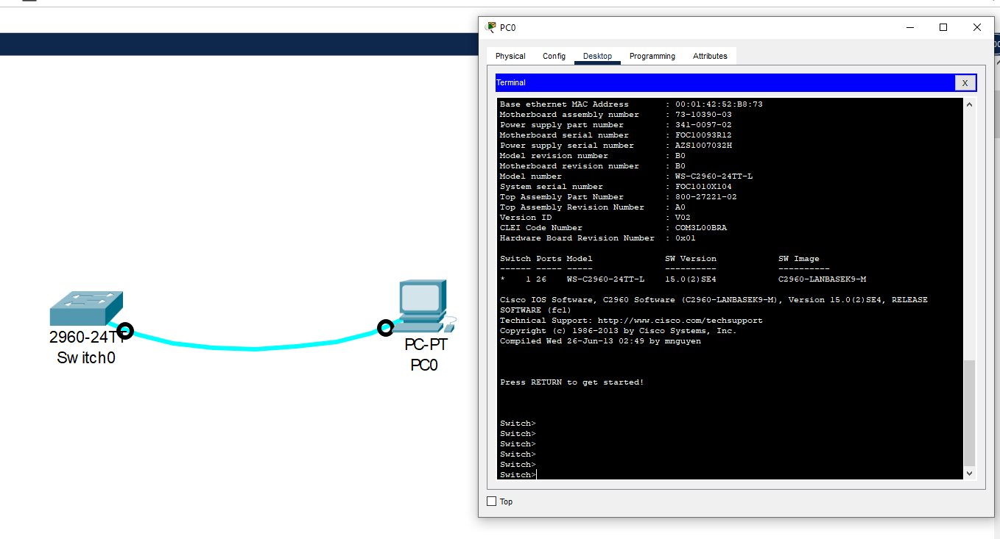
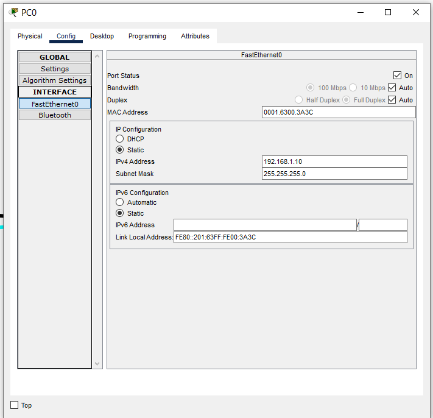

#  Лабораторная работа. Базовая настройка коммутатора
###  Задание:

1. [__Часть 1. Проверка конфигурации коммутатора по умолчанию__](#часть-1-проверка-конфигурации-коммутатора-по-умолчанию)
2. [__Часть 2. Создание сети и настройка основных параметров устройства__](#часть-2-создание-сети-и-настройка-основных-параметров-устройства)
  * Настройте базовые параметры коммутатора.
  * Настройте IP-адрес для ПК.
3. [__Часть 3. Проверка сетевых подключений__](#часть-3-проверка-сетевых-подключений)
  * Отобразите конфигурацию устройства.
  * Протестируйте сквозное соединение, отправив эхо-запрос.
  * Протестируйте возможности удаленного управления с помощью Telnet.

[Ссылка на итоговый файл CPT](\cpt00.pkt)

###  Решение:
#### Часть 1. Проверка конфигурации коммутатора по умолчанию

Для проверки конфигурации подключаемся к коммутатору через консольный кабель и устанавливаем соединение через программу эмуляции терминала:



Проверяем настройки коммутатора по-умолчанию. Заходим в привилегированный режим  
```enable```

Проверяем действующий конфиг:  
```show running-config```

Вывод:
```
Building configuration...

Current configuration : 1080 bytes
!
version 15.0
no service timestamps log datetime msec
no service timestamps debug datetime msec
no service password-encryption
!
hostname Switch
!
!
!
!
!
!
spanning-tree mode pvst
spanning-tree extend system-id
!
interface FastEthernet0/1
!
interface FastEthernet0/2
!
interface FastEthernet0/3
!
interface FastEthernet0/4
!
interface FastEthernet0/5
!
interface FastEthernet0/6
!
interface FastEthernet0/7
!
interface FastEthernet0/8
!
interface FastEthernet0/9
!
interface FastEthernet0/10
!
interface FastEthernet0/11
!
interface FastEthernet0/12
!
interface FastEthernet0/13
!
interface FastEthernet0/14
!
interface FastEthernet0/15
!
interface FastEthernet0/16
!
interface FastEthernet0/17
!
interface FastEthernet0/18
!
interface FastEthernet0/19
!
interface FastEthernet0/20
!
interface FastEthernet0/21
!
interface FastEthernet0/22
!
interface FastEthernet0/23
!
interface FastEthernet0/24
!
interface GigabitEthernet0/1
!
interface GigabitEthernet0/2
!
interface Vlan1
 no ip address
 shutdown
!
!
!
!
line con 0
!
line vty 0 4
 login
line vty 5 15
 login
!
!
!
!
end
```
Видим 24 интерфейса FastEthernet, 2 интерфейса GigabitEthernet, линии vty (витруальных терминалов) разбиты на 2 диапазона: 0-4 и 5-15.

Проверим загрузочный конфиг:
```
Switch#show startup-config 
startup-config is not present
```
Загрузочного конфига нет, т.к. коммутатор новый, из коробки.
***
Изучаем характеристики SVI для VLAN 1:
```
Switch#show interfaces vlan 1
Vlan1 is administratively down, line protocol is down
  Hardware is CPU Interface, address is 0060.5c5b.4911 (bia 0060.5c5b.4911)
  MTU 1500 bytes, BW 100000 Kbit, DLY 1000000 usec,
     reliability 255/255, txload 1/255, rxload 1/255
  Encapsulation ARPA, loopback not set
  ARP type: ARPA, ARP Timeout 04:00:00
  Last input 21:40:21, output never, output hang never
  Last clearing of "show interface" counters never
  Input queue: 0/75/0/0 (size/max/drops/flushes); Total output drops: 0
  Queueing strategy: fifo
  Output queue: 0/40 (size/max)
  5 minute input rate 0 bits/sec, 0 packets/sec
  5 minute output rate 0 bits/sec, 0 packets/sec
     1682 packets input, 530955 bytes, 0 no buffer
     Received 0 broadcasts (0 IP multicast)
     0 runts, 0 giants, 0 throttles
     0 input errors, 0 CRC, 0 frame, 0 overrun, 0 ignored
     563859 packets output, 0 bytes, 0 underruns
     0 output errors, 23 interface resets
     0 output buffer failures, 0 output buffers swapped out
```
Видим что SVI принудительно выключен, MAC-адрес "0060.5c5b.4911", IP-адрес не назначен

Проверим IP настройки:
```
Switch#show ip interface vlan 1
Vlan1 is administratively down, line protocol is down
  Internet protocol processing disabled
```
IP протокол выключен
***
Изучим сведения о версии ОС Cisco IOS на коммутаторе:
```
Switch#show version 
Cisco IOS Software, C2960 Software (C2960-LANBASEK9-M), Version 15.0(2)SE4, RELEASE SOFTWARE (fc1)
Technical Support: http://www.cisco.com/techsupport
Copyright (c) 1986-2013 by Cisco Systems, Inc.
Compiled Wed 26-Jun-13 02:49 by mnguyen

ROM: Bootstrap program is C2960 boot loader
BOOTLDR: C2960 Boot Loader (C2960-HBOOT-M) Version 12.2(25r)FX, RELEASE SOFTWARE (fc4)

Switch uptime is 39 minutes
System returned to ROM by power-on
System image file is "flash:c2960-lanbasek9-mz.150-2.SE4.bin"


This product contains cryptographic features and is subject to United
States and local country laws governing import, export, transfer and
use. Delivery of Cisco cryptographic products does not imply
third-party authority to import, export, distribute or use encryption.
Importers, exporters, distributors and users are responsible for
compliance with U.S. and local country laws. By using this product you
agree to comply with applicable laws and regulations. If you are unable
to comply with U.S. and local laws, return this product immediately.

A summary of U.S. laws governing Cisco cryptographic products may be found at:
http://www.cisco.com/wwl/export/crypto/tool/stqrg.html

If you require further assistance please contact us by sending email to
export@cisco.com.

cisco WS-C2960-24TT-L (PowerPC405) processor (revision B0) with 65536K bytes of memory.
Processor board ID FOC1010X104
Last reset from power-on
1 Virtual Ethernet interface
24 FastEthernet interfaces
2 Gigabit Ethernet interfaces
The password-recovery mechanism is enabled.

64K bytes of flash-simulated non-volatile configuration memory.
Base ethernet MAC Address       : 00:60:5C:5B:49:11
Motherboard assembly number     : 73-10390-03
Power supply part number        : 341-0097-02
Motherboard serial number       : FOC10093R12
Power supply serial number      : AZS1007032H
Model revision number           : B0
Motherboard revision number     : B0
Model number                    : WS-C2960-24TT-L
System serial number            : FOC1010X104
Top Assembly Part Number        : 800-27221-02
Top Assembly Revision Number    : A0
Version ID                      : V02
CLEI Code Number                : COM3L00BRA
Hardware Board Revision Number  : 0x01


Switch Ports Model              SW Version            SW Image
------ ----- -----              ----------            ----------
*    1 26    WS-C2960-24TT-L    15.0(2)SE4            C2960-LANBASEK9-M


Configuration register is 0xF
```


Коммутатор работает c ОС Cisco IOS версии **15.0(2)SE4**  
Файл образа системы называется **C2960-LANBASEK9-M**
***
Изучим свойства по умолчанию интерфейса FastEthernet, который используется компьютером PC-A:
```
Switch#show interfaces fastEthernet 0/6
FastEthernet0/6 is up, line protocol is up (connected)
  Hardware is Lance, address is 0005.5e12.d206 (bia 0005.5e12.d206)
 BW 100000 Kbit, DLY 1000 usec,
     reliability 255/255, txload 1/255, rxload 1/255
  Encapsulation ARPA, loopback not set
  Keepalive set (10 sec)
  Full-duplex, 100Mb/s
  input flow-control is off, output flow-control is off
  ARP type: ARPA, ARP Timeout 04:00:00
  Last input 00:00:08, output 00:00:05, output hang never
  Last clearing of "show interface" counters never
  Input queue: 0/75/0/0 (size/max/drops/flushes); Total output drops: 0
  Queueing strategy: fifo
  Output queue :0/40 (size/max)
  5 minute input rate 0 bits/sec, 0 packets/sec
  5 minute output rate 0 bits/sec, 0 packets/sec
     956 packets input, 193351 bytes, 0 no buffer
     Received 956 broadcasts, 0 runts, 0 giants, 0 throttles
     0 input errors, 0 CRC, 0 frame, 0 overrun, 0 ignored, 0 abort
     0 watchdog, 0 multicast, 0 pause input
     0 input packets with dribble condition detected
     2357 packets output, 263570 bytes, 0 underruns
     0 output errors, 0 collisions, 10 interface resets
     0 babbles, 0 late collision, 0 deferred
     0 lost carrier, 0 no carrier
     0 output buffer failures, 0 output buffers swapped out
```
Интерфейс включен, для включения надо использовать команду `no shutdown`. MAC "0005.5e12.d206". Дуплекс и скорость - "Full-duplex, 100Mb/s".  
***
Изучим флеш-память:
```
Switch#show flash: 
Directory of flash:/

    1  -rw-     4670455          <no date>  2960-lanbasek9-mz.150-2.SE4.bin

64016384 bytes total (59345929 bytes free)
```
Файл **2960-lanbasek9-mz.150-2.SE4.bin** - файл образа Cisco IOS.

***
### Часть 2. Создание сети и настройка основных параметров устройства
#### Шаг 1. Настраиваем базовые параметры коммутатора
Применяем базовые параметры конфигурации:
```
Switch>en
Switch#conf
Switch#configure t
Switch#configure terminal 
Enter configuration commands, one per line.  End with CNTL/Z.
Switch(config)#no ip domain-lookup
Switch(config)#hostname S1
S1(config)#service password-encryption
S1(config)#enable secret class
S1(config)#banner motd #
Enter TEXT message.  End with the character '#'.
Unauthorized access is strictly prohibited. #
```
Назначаем IP-адрес интерфейсу SVI на коммутаторе и включаем его:
```
S1(config-if)#ip address 192.168.1.2 255.255.255.0 
S1(config-if)#no shutdown 
```
Устанавливаем маршрут по-умолчанию:
```
S1(config)#ip default-gateway 192.168.1.1 
```
Устанавливаем пароль на терминальное подключение:
```
S1(config)#line con 0
S1(config-line)#password cisco
S1(config-line)#login
```
Команда `login` нужна для запроса пароля 

Чтобы консольные сообщения не прерывали выполнение команд, используем параметр logging synchronous:
```
S1(config)#line con 0
S1(config-line)#logging synchronous 
```
Настраиваем каналы виртуального соединения для удаленного управления (vty) 0-5:
```
S1(config)#line vty 0 4
S1(config-line)#password cisco
```
***
#### Шаг 2. Настройте IP-адрес на компьютере PC-A
Настраивам IP адрес компьютере PC-A согласно таблице:  


***
### Часть 3. Проверка сетевых подключений
#### Шаг 1. Отобразим конфигурацию коммутатора
Проверяем применение команд `sho r`
```
S1#show running-config 
Building configuration...

Current configuration : 1326 bytes
!
version 15.0
no service timestamps log datetime msec
no service timestamps debug datetime msec
service password-encryption
!
hostname S1
!
enable secret 5 $1$mERr$9cTjUIEqNGurQiFU.ZeCi1
!
!
!
no ip domain-lookup
!
!
!
spanning-tree mode pvst
spanning-tree extend system-id
!
interface FastEthernet0/1
!
interface FastEthernet0/2
!
interface FastEthernet0/3
!
interface FastEthernet0/4
!
interface FastEthernet0/5
!
interface FastEthernet0/6
!
interface FastEthernet0/7
!
interface FastEthernet0/8
!
interface FastEthernet0/9
!
interface FastEthernet0/10
!
interface FastEthernet0/11
!
interface FastEthernet0/12
!
interface FastEthernet0/13
!
interface FastEthernet0/14
!
interface FastEthernet0/15
!
interface FastEthernet0/16
!
interface FastEthernet0/17
!
interface FastEthernet0/18
!
interface FastEthernet0/19
!
interface FastEthernet0/20
!
interface FastEthernet0/21
!
interface FastEthernet0/22
!
interface FastEthernet0/23
!
interface FastEthernet0/24
!
interface GigabitEthernet0/1
!
interface GigabitEthernet0/2
!
interface Vlan1
 ip address 192.168.1.2 255.255.255.0
!
ip default-gateway 192.168.1.1
!
banner motd ^C
Unauthorized access is strictly prohibited. ^C
!
!
!
line con 0
 password 7 0822455D0A16
 logging synchronous
 login
!
line vty 0 4
 password 7 0822455D0A16
 login
line vty 5 15
 login
!
!
!
!
end
```
Все применилось, ура!

Проверяем параметры VLAN 1:
```
S1#show interfaces vlan 1
Vlan1 is up, line protocol is up
  Hardware is CPU Interface, address is 0060.5c5b.4911 (bia 0060.5c5b.4911)
  Internet address is 192.168.1.2/24
  MTU 1500 bytes, BW 100000 Kbit, DLY 1000000 usec,
     reliability 255/255, txload 1/255, rxload 1/255
  Encapsulation ARPA, loopback not set
  ARP type: ARPA, ARP Timeout 04:00:00
  Last input 21:40:21, output never, output hang never
  Last clearing of "show interface" counters never
  Input queue: 0/75/0/0 (size/max/drops/flushes); Total output drops: 0
  Queueing strategy: fifo
  Output queue: 0/40 (size/max)
  5 minute input rate 0 bits/sec, 0 packets/sec
  5 minute output rate 0 bits/sec, 0 packets/sec
     1682 packets input, 530955 bytes, 0 no buffer
     Received 0 broadcasts (0 IP multicast)
     0 runts, 0 giants, 0 throttles
     0 input errors, 0 CRC, 0 frame, 0 overrun, 0 ignored
     563859 packets output, 0 bytes, 0 underruns
     0 output errors, 23 interface resets
     0 output buffer failures, 0 output buffers swapped out
```
У этого интерфейса нет полосы пропускания потому что это не физический интерфейс, а виртуальный, но я не уверен)

***
#### Шаг 2. Протестируем сквозное соединение, отправив эхо-запрос:
```
C:\>ping 192.168.1.10

Pinging 192.168.1.10 with 32 bytes of data:

Reply from 192.168.1.10: bytes=32 time=2ms TTL=128
Reply from 192.168.1.10: bytes=32 time=7ms TTL=128
Reply from 192.168.1.10: bytes=32 time<1ms TTL=128
Reply from 192.168.1.10: bytes=32 time=2ms TTL=128

Ping statistics for 192.168.1.10:
    Packets: Sent = 4, Received = 4, Lost = 0 (0% loss),
Approximate round trip times in milli-seconds:
    Minimum = 0ms, Maximum = 7ms, Average = 2ms

C:\>ping 192.168.1.2

Pinging 192.168.1.2 with 32 bytes of data:

Request timed out.
Reply from 192.168.1.2: bytes=32 time<1ms TTL=255
Reply from 192.168.1.2: bytes=32 time<1ms TTL=255
Reply from 192.168.1.2: bytes=32 time<1ms TTL=255

Ping statistics for 192.168.1.2:
    Packets: Sent = 4, Received = 3, Lost = 1 (25% loss),
Approximate round trip times in milli-seconds:
    Minimum = 0ms, Maximum = 0ms, Average = 0ms

C:\>
```
Тест прошел успешно!
***
#### Шаг 3. Проверьте удаленное управление коммутатором S1
Подключаемся через telnet с PC-A и сохраняем конфигурацию:
```
Trying 192.168.1.2 ...Open
Unauthorized access is strictly prohibited. 


User Access Verification

Password: 
Password: 
S1>en
Password: 
S1#cop
S1#copy ru
S1#copy running-config s
S1#copy running-config st
S1#copy running-config startup-config 
Destination filename [startup-config]? 
Building configuration...
[OK]
S1#
```

Пароль VTY для коммутатора необходимо настраивать для возможности удаленного подключения. Чтобы пароли не отправлялись в незашифрованном виде надо использовать SSH. 

### Приложение А. Инициализация и перезагрузка коммутатора
Воспользуемся командой `show flash`, чтобы определить, были ли созданы сети VLAN на коммутаторе, у файл **vlan.dat** не был обнаружен.  

Вводим команду `erase startup-config`, чтобы удалить файл загрузочной конфигурации из NVRAM  

Перезагружаем коммутатор, чтобы удалить устаревшую информацию о конфигурации из памяти командой `reload`

После перезагрузки видим что коммутатор вернулся в свое изначально состояние "из коробки":
```
Switch#show running-config 
Building configuration...

Current configuration : 1080 bytes
!
version 15.0
no service timestamps log datetime msec
no service timestamps debug datetime msec
no service password-encryption
!
hostname Switch
!
!
!
!
!
!
spanning-tree mode pvst
spanning-tree extend system-id
!
interface FastEthernet0/1
!
interface FastEthernet0/2
!
interface FastEthernet0/3
!
interface FastEthernet0/4
!
interface FastEthernet0/5
!
interface FastEthernet0/6
!
interface FastEthernet0/7
!
interface FastEthernet0/8
!
interface FastEthernet0/9
!
interface FastEthernet0/10
!
interface FastEthernet0/11
!
interface FastEthernet0/12
!
interface FastEthernet0/13
!
interface FastEthernet0/14
!
interface FastEthernet0/15
!
interface FastEthernet0/16
!
interface FastEthernet0/17
!
interface FastEthernet0/18
!
interface FastEthernet0/19
!
interface FastEthernet0/20
!
interface FastEthernet0/21
!
interface FastEthernet0/22
!
interface FastEthernet0/23
!
interface FastEthernet0/24
!
interface GigabitEthernet0/1
!
interface GigabitEthernet0/2
!
interface Vlan1
 no ip address
 shutdown
!
!
!
!
line con 0
!
line vty 0 4
 login
line vty 5 15
 login
!
!
!
!
end
```

Коммутатор успешно сброшен!